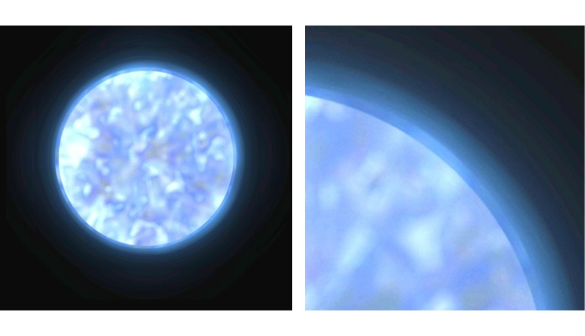

The universe always has secrets hiding from the scientific world out there on the Earth. When astronomers in Armagh Observatory in Northern Ireland were busy studying the helium-rich hot sub-dwarfs and their chemical nature, little did they know that they were about to find a new fingerprint in the astronomical spectra of the evolved star LS IV-14 116, which is 2,000 light-years from the Sun. From the data collected using the Anglo-Australian Telescope at the Siding Spring Observatory in New South Wales, the astronomers discovered large amounts of zirconium in the layers of gas present around the star. This form of zirconium only exists at an extreme temperature of 20,000 C. The team led by the then graduate student Dr. Naslim Neelamkodan and her advisor Dr. Simon Jeffery measured the zirconium abundance in LS IV-14 116 to be 10,000 times higher than in the Sun. Zirconium is famously known as the ‘fake diamond’ and is used in jewellery making due to its lustrous properties but has never previously been found in an astronomical spectrum. 

The clouds of gas around the stars are the only part of a star that can be seen directly, and these metals form layers at different heights according to the temperature of the star. This could be attributed to the competition between two processes called gravitational settling and radiative levitation. Radiative levitation describes the way in which light interacts with different atoms with different strength and results in multiple cloud-like layers, each with different composition. After a long time, say 1000 or 10,0000 years, these layers of zirconium may be displaced by other metals. Thus, by identifying similar stars with different layers of other elemental species, the sequence by which these stars are formed could be identified. On the other hand, stars like the Sun don't exhibit these kinds of layers due to convection and other mixing processes. Another intriguing observation made by the astronomers was that these stars are rotating rather slowly unlike the stars formed from a binary pair or a merger which results in rapid rotation. Other than zirconium, strong signatures in the stellar spectrum came from strontium, germanium and yttrium.

<figure>

<figcaption align = "center">An artist’s impression of LS IV – 14 116. The white clouds are rich in zirconium and lie above the blue surface of the star. Image: Natalie Behara)</figcaption>

</figure>

The universe never fails to impress the scientific world with its exciting peculiarities that open the door to knowledge by which we thrive in this world. Being a very ordinary girl from a traditional family in a village called Edakkara in Kerala, Dr. Naslim paved her own path and world in the scientific community, inspiring a bunch of young girls back in her village. Little did I know, back in 2012, when I first read about her discovery in the newspaper, that I would get an opportunity to write about her contribution, reminiscing those moments of inspiration, hailing from the same old village Edakkara, being nothing more than an ordinary girl.

<figure>

<figcaption align = "center">Mahinsha, S. Speaker G. Karthikeyan presenting a memento to Naslim Neelamkodan. The Hindu, 28 December 2018, </figcaption>

</figure>

-Aswathi K, B'19

Sources:

1. Baldwin, Emily. [“Most Zirconium-Rich Star Discovered.”](www.astronomynow.com/news/n1012/08zirconium/) *Astronomy now,* 8 December 2010
2.  Byrd, Debora. [“Astronomers Discover Star With Glittering Zirconium Clouds.”](www.earthsky.org/space/star-with-glittering-zirconium-clouds-discovered/) *EarthSky,* 5 January 2011
3.  Ravilious, Kate . ["Fake Diamond" Star Discovered.”](www.nationalgeographic.com/science/article/101208-fake-diamond-star-zirconium-zirconia-zircon-science-space) *National Geographic,* 9 December 2010
4. [“She Reached for the Stars, Discovered One.” ](www.thehindu.com/news/cities/Thiruvananthapuram/she-reached-for-the-stars-discovered-one/article4248809.ece)The Hindu, 28 December 2018, 

[Cover Image](imgur.com/t/spaceengine/8GghfcI)

