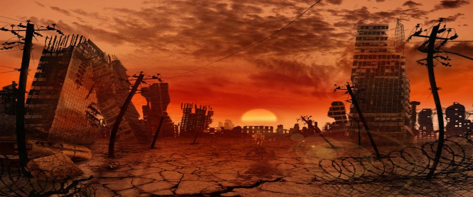

title: ഷിയോലാനു൦ ഒന്നാം സന്താനങ്ങളും
author: Hruidya C. Babu 
date:  31-08-2021 
tags:   
-short story
-sci-fi
-malayalam
slug: sci-fi-story-malayalam
excerpt: നിഗൂഢതകളിലേക്ക് ഉള്ള അത്യധികം വെല്ലുവിളികൾ നിറഞ്ഞ ഒരു പ്രയാണം ആണ് മനുഷ്യജീവിതം. ഉത്തരങ്ങൾ തേടിയുള്ള യാത്രയിൽ അവരെ കാത്തിരിക്കുന്നത് കൂടുതൽ ചോദ്യങ്ങളും

---

"എവിടെയോ ഞങ്ങൾക്ക് പിഴച്ചു ... എന്നാൽ...”

ആ കത്ത് തുടർന്ന് വായിക്കാൻ ഹെലന്റെ മനസ്സ് വിസമ്മതിച്ചു. അപോക്കലിപ്സിന്റെ സമയത്ത്‌ ഭാവിയിൽ മനുഷ്യതലമുറ പുനർജനിക്കുകയാണെങ്കിൽ അവർക്ക് നൽകാൻ വേണ്ടി ഈ സന്ദേശം ബാക്കിവെച്ച ആ പൂർവികന്റെ രൂപം അവൾ മനസ്സിൽ ചിത്രീകരിക്കാൻ ശ്രമിച്ചു. അയാൾ തന്നെ പോലെ ആയിരുന്നോ? ഭൂമിയിൽ ജനിച്ചു ഭൂമിയിൽ തന്നെ മൃത്യു വരിച്ച ആ മനുഷ്യന് തന്നോട് പറയാൻ എന്തെല്ലാം ഉണ്ടായിരുന്നിരിക്കും? എന്താണ് ഭൂമി? എന്താണ് അവിടെ സംഭവിച്ചത്? ചിന്തകൾക്ക് വിരാമമില്ല. ഓരോ നിമിഷവും താൻ പുതിയ കണ്ടെത്തലുകൾ നടത്തുകയാണെന്ന് ഹെലന് തോന്നി.

"ഹെലൻ, വാ...ക്ലാസ് തുടങ്ങാൻ പോകയാ.."

കാതറിൻ ആണ്. ഹെലന്റെ സുഹൃത്ത്. അവൾ മുറിയുടെ വാതിൽക്കൽ വന്നു ഹെലനുവേണ്ടി കാത്തുനിൽക്കുകയാണ്. ഹെലൻ തൻ്റെ സ്റ്റഡി പാഡ് ബാഗിൽ കരുതലോടെ എടുത്തു വെച്ചു. കൂടെ ആ കത്തും. അവൾ പുറത്തേക്ക് ഇറങ്ങി.

"ഇന്നും കത്ത് വായിച്ചിരുന്ന് ക്ലാസ് ഉള്ള കാര്യം മറന്നു അല്ലെ?" കാതറിൻ ചോദ്യം ഉന്നയിച്ചപ്പോൾ ഒരു ചെറുപുഞ്ചിരി മാത്രം ഹെലൻ അവൾക്ക് നൽകി. 

"നീ എന്തിനാ ശരിക്കും ആ കത്ത് വായിച്ച്‌ ഇങ്ങനെ ടെൻഷൻ അടിക്കുന്നെ?"

"നീ എപ്പോഴെങ്കിലും ചിന്തിച്ചിട്ടുണ്ടോ , നമ്മുടെ മുൻഗാമികൾ എങ്ങനെ ആയിരുന്നു? എന്ത് കൊണ്ട് അവരുടെ ലോകം നശിച്ചു, എന്നൊക്കെ?"

"ഇല്ല…ഷിയോലാൻ പ്രകാരം ഭൂമി നശിച്ചത് അപോക്കലിപ്സ് കാരണം അല്ലേ?"

കാതറിൻ തുടർന്നു.

"ഭാഗ്യവശാൽ, ഇതൊക്കെ മുന്നിൽ കണ്ട നമ്മുടെ മുൻഗാമികൾ ഇനി വരാൻ പോകുന്ന മനുഷ്യവർഗത്തിനായി മറ്റൊരു ഭൂമിയെ സൃഷ്ടിച്ചു. അതാണ് നമ്മുടെ ഈ റ്റൃൂറ. ഭൂമിയിൽ നിന്നും തിരഞ്ഞെടുക്കപ്പെട്ട ആ ആറു പേർ മനുഷ്യഭ്രൂണങ്ങളുമായി ഇവിടെ എത്തി. അങ്ങനെ റ്റൃൂറ ഇന്ന് നമ്മൾ കാണുന്ന."

തൻ്റെ പ്രസംഗം അവസാനിപ്പിച്ച് കാതറിൻ ഹെലനെ നോക്കി.

"ഇതൊക്കെ നമ്മളെ അവർ പറഞ്ഞു പഠിപ്പിച്ച കാര്യങ്ങൾ. ചിലപ്പോൾ ഒക്കെ എനിക്ക് തോന്നും, ഇതിനുമപ്പുറം എന്തൊക്കെയോ ഉണ്ടെന്ന്."

"അതൊക്കെ നിന്റെ തോന്നൽ ആണ്. തൽക്കാലത്തേക്ക് നമുക്ക് നല്ല കുട്ടികൾ ആയി ക്ലാസ്സിലേക്ക് പോകാം."

കാതറിൻ ഹെലനെയും കൂട്ടി തിടുക്കത്തിൽ നടന്നു.

ക്ലാസ്സിൽ ഇരിക്കവേ ഹെലൻ വീണ്ടും ചിന്തകളിലേക്ക് വഴുതിവീണു. തൻ്റെ നിലനിൽപ്പിന്റെ ആധാരം അവൾ അന്വേഷിക്കുകയായിരുന്നു. റ്റൃൂറ ആണ് അവളുടെ ഭവനം. പൊടിക്കാറ്റും അമ്ലമഴയും മാത്രം അലങ്കരിച്ചിരുന്ന, ജീവന്റെ തുടിപ്പ് ഇല്ലായിരുന്ന ഒരു ചുവന്ന ഗോളം. ഇന്ന് അവിടെ അവൾ അടക്കം മൂന്ന് കോടി മനുഷ്യർ ജീവിക്കുന്നു. അന്നും ഇന്നും മൂന്നു കോടി. ഷിയോലാൻ ആണ് ഈ പുതിയ മാനവസംസ്കാരത്തിന്റെ അടിത്തറ പാകിയിരിക്കുന്നത്. ഇവിടേക്ക് ഭൂമിയിൽ നിന്നും എത്തിച്ചേർന്ന ആറ് പേർ ഇവിടെ മുളക്കാൻ പോകുന്ന സമൂഹത്തിനായി എഴുതിത്തയ്യാറാക്കിയ നിയമപുസ്തകം - "ഷിയോലാൻ". ഭൂമിയിൽ ഹോമോ സാപിയനുകൾ ചെയ്തുകൂട്ടിയ കൊള്ളരുതായ്മകൾ അവർത്തിക്കാതിരിക്കാനായി അവർ റ്റൃൂറയിലെ വാസികൾ എങ്ങനെ ആയിരിക്കണം , എങ്ങനെ ആകരുത് എന്ന് ഷിയോലാനിൽ കുറിച്ച് വെച്ചു.

അവർക്ക് ശേഷം വന്ന ആദ്യ തലമുറയാണ് "ഒന്നാം സന്താനങ്ങൾ" എന്ന് വിളിക്കപ്പെടുന്നത്. ഒന്നാം സന്താനങ്ങൾ തികച്ചും അതിബുദ്ധിമാന്മാരായിരുന്നു. അവർ ഷിയോലാനിലെ നിയമങ്ങളെ അൽഗോരിതങ്ങളുടെ രൂപത്തിലേക്ക് പരിവർത്തനം ചെയ്തു. സാങ്കേതികവിദ്യകളിലെ മിടുക്ക് വെച്ച് അവർ ആ അൽഗോരിതങ്ങൾ ഉപയോഗിക്കുന്ന മെഷീനുകൾ നിർമ്മിക്കുകയും അവയെ അവരുടെ തലച്ചോറുകളുമായി ബന്ധിപ്പിക്കുകയും ചെയ്തു. മനുഷ്യന്റെ ശരീരത്തിന് മേൽ വന്ന ആ നിയന്ത്രണം തികച്ചും ഭയാനകം ആയിരുന്നു. എപ്പോഴെല്ലാം മനുഷ്യർ ഷിയോലാൻ നിയമങ്ങൾ പാലിക്കാതിരുന്നോ , അവരുടെ തലച്ചോറുകൾ പ്രവർത്തിക്കാതിരിക്കുകയും അവർ മരിക്കുകയും ചെയ്തു.

ഇപ്പോൾ 361 റ്റൃൂറ വർഷങ്ങൾ കടന്നുപോയിരിക്കുന്നു. അന്നത്തെ പോലെ ഇപ്പോൾ കൂടെ കൊണ്ട് നടക്കാൻ മെഷീനുകൾ വേണ്ട. പകരം തലച്ചോറ് തന്നെ ആണ് മെഷീൻ. ഈ നിയന്ത്രിതസ്വഭാവം ഇപ്പോൾ ജനിതകമായി കൈമാറ്റം ചെയ്യപ്പെടുന്ന ഒന്നായി മാറിയിരിക്കുന്നു. കോശങ്ങളിലെ ചില ജീനുകൾ "ഷിയോലാൻ ജീനുകൾ" ആയി പരിണാമം ചെയ്തു അത്രേ. ചുരുക്കത്തിൽ, ഷിയോലാനിൽ എന്താണോ പറഞ്ഞിരിക്കുന്നത്, അത് മാത്രമേ ഒരു മനുഷ്യന് ഇവിടെ ചിന്തിക്കാനും പ്രവർത്തിക്കാനും കഴിയുള്ളു.

ഹെലന്റെ കാതിൽ പെട്ടെന്ന് ഒരു ഘനശബ്ദം മുഴങ്ങി. ശരം പോലെ അവളുടെ ഉള്ളിലേക്ക് തുളച്ചുകയറുന്നു അത്.

"ഹെലൻ?"

അവൾ ഞെട്ടിയുണർന്നു. ആ ശബ്ദത്തിന്റെ തീവ്രത മങ്ങിത്തുടങ്ങി. തൻ്റെ മുന്നിൽ നിന്ന ഒരു സ്ത്രീരൂപത്തിലേക്ക് അവൾ നോക്കി.

"മിസ്സ്?"

"ക്ലാസ്സിൽ ഇരുന്ന് സ്വപ്നം കാണുവാണോ?"

"ഉം..അല്ല."

"അല്ലെങ്കിൽ നിനക്ക് കൊള്ളാം. ഈയിടെ ആയിട്ട് നിന്റെ ഈ പകൽ സ്വപ്നം കാണുന്ന ശീലം ഞാൻ ശ്രദ്ധിക്കുന്നുണ്ട്."

കാതറിൻ ഹെലനെ തിരിഞ്ഞുനോക്കി. ഹെലൻ നിസ്സംഗതയോടെ അവളുടെ മുഖത്തെ നേരിട്ടു.

ക്ലാസ് കഴിഞ്ഞയുടൻ ഹെലൻ മുറിയിൽ തിരിച്ചെത്തി. നാളെയാണ് അവളുടെ അച്ഛന്റെ ചരമവാർഷികം. അവൾക്ക് പത്തു വയസ്സുള്ളപ്പോൾ ആണ് അച്ഛൻ പിരിഞ്ഞുപോയത്. വൈകാതെ തന്നെ അമ്മയും. കഴിഞ്ഞ അഞ്ചു വർഷങ്ങൾ ആയി അവൾ സ്വന്തം വീട്ടിൽ ഒറ്റക്ക് താമസിക്കുന്നു. നേരത്തെ പറഞ്ഞുവല്ലോ, മൂന്നു കോടി ജനങ്ങൾക്ക് മാത്രം ആണ് ഒരു സമയം റ്റൃൂറയിൽ താമസിക്കാൻ പറ്റുക. ഈ ഒരു ജനസംഖ്യ നിലനിർത്തണമെങ്കിൽ ജനനവും മരണവും സംതുലിതമായിരിക്കണം. ഓരോ മനുഷ്യനിലും ഉള്ള ഷിയോലാൻ ജീനുകൾ പ്രവർത്തിക്കുന്നത് ഒരു നിശ്ചിതകാലത്തേക്ക് ആണ്. അത് കഴിയുമ്പോൾ അവ നശിക്കാൻ തുടങ്ങും. പതിയെ അവ ആ വ്യക്തിയെ ദുർബലമാക്കും. അങ്ങനെ ആണ് ഇവിടെ ആളുകൾ മരിക്കുക. ഒരാളുടെ മരണസമയം ആർക്കും പ്രവചിക്കാൻ സാധിക്കില്ല. അങ്ങനെ അപ്രതീക്ഷിതമായി ആണ് ഹെലന്റെ അച്ഛനും അമ്മയും മരണത്തോട് അടിയറവു പറഞ്ഞത്.

ഹെലൻ ബാഗിൽ നിന്ന് സ്റ്റഡി പാഡും , രാവിലെ വായിച്ചുകൊണ്ട് ഇരിക്കുകയായിരുന്ന ആ കത്തും പുറത്തേക്ക് എടുത്തു. അവൾ അസ്വസ്ഥയായിരുന്നു. അത് ഒന്നുകൂടി വായിക്കാതിരിക്കാൻ അവൾക്ക് കഴിഞ്ഞില്ല. കസേരയിൽ ചമ്രം പടിഞ്ഞിരുന്നതിനുശേഷം അവൾ കത്ത് തുറന്നു.

**"ഭാവിയിൽ വരാൻ പോകുന്ന എന്റെ പിൻഗാമികൾ അറിയുവാൻ,** **ഞങ്ങൾ ചെയ്തത് തെറ്റ്. എവിടെയോ ഞങ്ങൾക്ക് പിഴച്ചു... എന്നാൽ...ഇനി അത് ആവർത്തിക്കരുത്…നിയമങ്ങൾ വരും. അതിനായി ഞങ്ങൾ റ്റൃൂറയിലേക്ക് ആറുപേരെ അയയ്ക്കുകയാണ്. ഇവർ റ്റൃൂറയിൽ ഒരു രണ്ടാം ഭൂമി പണിയും. അവിടുത്തെ ജനങ്ങൾക്കായി നിയമങ്ങൾ കൊണ്ട് വരും, ഷിയോലാൻറെ രൂപത്തിൽ. എന്നാൽ, ഷിയോലാൻ എപ്പോഴും ശരിയായ കരങ്ങളിൽ ആണെന്ന് ഉറപ്പു വരുത്തുക."**

വീണ്ടും ചോദ്യങ്ങൾ അവളിലേക്ക് പാഞ്ഞുകയറുകയാണ്. ഷിയോലാൻ ജീനുകൾ ആണ് ഒരാളുടെ മരണസമയം തീരുമാനിക്കുന്നത്. അപ്പോൾ പിന്നെ ഇവിടേക്ക് ആദ്യം എത്തിയ ആ ആറുപേരുടെ അന്ത്യം എങ്ങനെ ആയിരുന്നു? അവരെക്കുറിച്ച് ഷിയോലാനിൽ കൂടുതൽ ഒന്നും പറയാത്തത് എന്ത് കൊണ്ട് ആയിരിക്കും? അവർക്ക് ശേഷം വന്ന "ഒന്നാം സന്താനങ്ങൾക്ക്'" എങ്ങനെ ആണ് സ്വന്തം തലച്ചോറുകളെ വരെ നിയന്ത്രിക്കാനുള്ള വിദ്യ ലഭിച്ചത്?

"എന്നെ ആരാണ് നിയന്ത്രിക്കുന്നത്?" - അവൾ പിറുപിറുത്തു.

"ആഹ്!" അലോസരപ്പെടുത്തുന്ന ആ ശബ്ദം അവളുടെ ചെവിയിൽ വീണ്ടും മുഴങ്ങാൻ തുടങ്ങി. വേദന കൊണ്ട് അവൾ പുളഞ്ഞു. പതിയെ അവളുടെ ശരീരത്തിലേക്ക് ആ വേദന പടരാൻതുടങ്ങി. ഒരു അന്ത്യത്തിനായി അത് കേഴുകയായിരുന്നു.

ഉടലും ചേതസ്സും വേർപെട്ടുപോകുന്ന അവസ്ഥയിലും അവൾ ഉത്തരങ്ങൾക്കായി മുറവിളിച്ചു. അച്ഛന്റെയും അമ്മയുടെയും പിന്നെ ചില അപരിചിതരുടെയും മുഖങ്ങൾ അവൾക്കു മുന്നിൽ മിന്നിമറഞ്ഞു. ആരുടെയോ അശരീരി , "ഹെലൻ?..." എന്നാൽ അത് പൂർത്തിയാക്കപ്പെട്ടില്ല. എല്ലാ രൂപങ്ങളും അവളിൽ നിന്ന് അകന്നുപോയി.

കസേരയിൽ നിന്നും വീണ അവളുടെ മനസ്സ് മരവിക്കുകയാണ്. നിമിഷങ്ങൾക്കകം അവളുടെ ഹൃദയം നിലച്ചു. കൈകളിൽ മുറുകെപ്പിടിച്ചിരുന്ന കത്ത് അവൾക്കൊപ്പം നശിച്ചു. ചെറുകഷണങ്ങൾ ആയി അത് മുറിഞ്ഞുപോയിരുന്നു.

-Hruidya C Babu B'19

[Image Source](https://alumni.berkeley.edu/california-magazine/summer-2014-apocalypse/apocalypse-later-end-always-near-and-heres-hoping-it)

