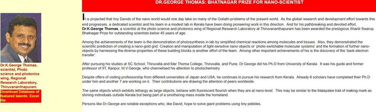
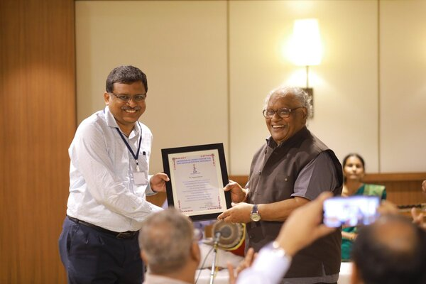
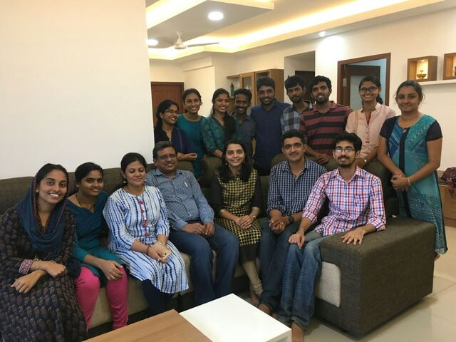
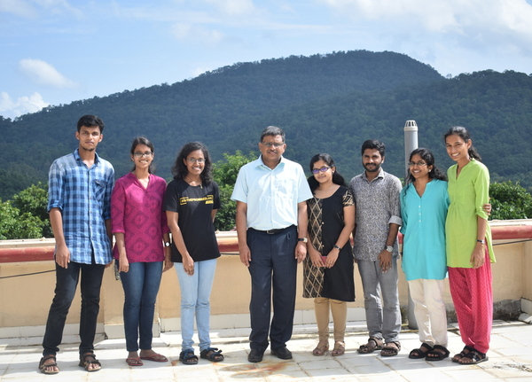
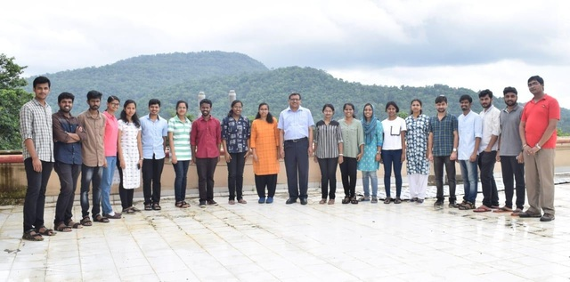
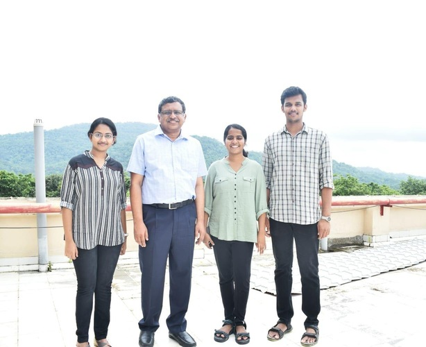

From the year when Prof. C.N.R. Rao and Prof. M.V. George jointly laid the foundation stone of one of the premier research institutes in India, this photochemist has witnessed significant milestones in the institutional history of the Indian Institute of Science Education and Research, Thiruvananthapuram. Prof. K. George Thomas is also known by the sobriquet ‘KGT’ to his colleagues and students.

Prof. George Thomas received his Ph.D. degree in Chemistry from the University of Kerala and afterward worked as a senior scientist in the Photosciences & Photonics Section of the CSIR-NIIST since April 2010. In 2008, he was invited to join as a professor at the newly established IISER Thiruvananthapuram. He joined as a Professor and its founding Dean in the year 2010. Prof. KGT is the recipient of several awards and distinctions, including the prestigious science prize by the Government of India, the Shanti Swarup Bhatnagar Prize in Chemical Sciences in 2006. He is the recipient of the J. C. Bose National Fellowship since 2014. He is also an elected fellow of the Indian National Science Academy, New Delhi, and Indian Academy of Sciences, Bangalore.

<figcaption align = "center">Shanthi Swarup Bhatnagar Prize Award presented to Prof. K George Thomas</figcaption>

Prof. KGT has mentored a generation of graduate and undergraduate students. Working in his group, twenty-two students received doctoral degrees; many are faculty members in major academic and scientific institutes, both in India and abroad. Prof. KGT is currently serving as the President of the Asian and Oceanian Photochemistry Association and Dean, Faculty affairs of IISER Thiruvananthapuram. He also serves as a member of several important scientific and academic committees of the Government of India. Prof. KGT has made significant contributions in several areas of photosciences and nanomaterials, focusing on light-matter interactions at the nanoscale using plasmonic systems and semiconductor quantum dots. [His group](https://www.kgtlab.in/) uses various steady-state and time-solved techniques such as transient absorption and single-molecule spectroscopies to understand the dynamics of the electron and energy transfer processes in these systems.

<figcaption align = "center">Prof. KGT Receiving token of appreciation from Prof. C.N.R Rao</figcaption>

Just like quanta of electromagnetic radiation are called photons, plasmons are the energy packets associated with the rapid oscillations of electron density in plasma or other conducting systems such as semiconductors. These plasmons can drive major chemical reactions, and the group studies the intricate details of such phenomena. At the nanoscale, such plasmonic systems can also interact with light. If plasmons are coupled with excitons (bound electron-hole pairs in semiconductors), new light-matter interactions arise. This is another topic which the group intends to look at. They also aim at understanding trap states in semiconductor nanocrystals where charge carriers are localized in terms of their wavefunctions. They investigate the enhancement in the Raman scattering by molecules adsorbed on rough metal surfaces or by nanostructures through the Surface-enhanced Raman spectroscopy (SERS) technique. The SERS technique relies predominantly on the localized surface plasmon resonance (LSPR) of metal nanostructures and hence can improve with the number of plasmonic hotspots in them. His group is also interested in understanding the chiroptical properties (chiral-optical responses) of supramolecular and nanostructured systems. 

Findings by the lab have been accepted and published in notable journals like The Journal of Chemical Physics, ACS Nano, Chemistry of Materials and many more. The group also had collaborations with Dr. R. S. Swathi (IISER Thiruvananthapuram), Dr. Stephen Gray (Argonne National Laboratory), Dr. Cristina Sissa and Prof. Anna Painelli (University of Parma), Prof. Shobhana Narasimhan and Prof. S. Balasubramanian (JNCASR, Bangalore). 

---
We were fortunate to conduct an interesting interview with Prof. KGT, where we discussed his professional and personal life. Here is a short excerpt , but we discussed a lot more in this session. Do listen to the full interview on [SoundCloud](https://soundcloud.com/anvesha-content/lab-feature-the-george-thomas-group-interview-with-prof-k-george-thomas) or watch it on our [YouTube channel](https://youtu.be/oz7LgkKnbhg)

Hruidya: We warmly welcome Prof. KGT for this interview of ours. We welcome you, sir! 

KGT: Hello Aswathi and Hruidya! Good morning. Thank you for the introduction!

Hruidya: Without further delay, I think we can move on to the questions. Shall we, sir? 

KGT: Sure! Yes! Whatever you want, you can ask me!

Hruidya: The first question is somewhat informal. As we see, you’re always a  jovial and highly enthusiastic person. Be it in the classroom or the lab while doing research. Can you share the secret behind this vibrant personality of yours?

KGT: Hruidya, you’re absolutely correct! I have high levels of energy and I am a highly enthusiastic person as you clearly mentioned. Because I think I feel young in my mind. Even though you can see my grey hair unlike many of my colleagues here, my mind is young. The credit goes to my students; past students and current graduate and undergraduate students. Being associated with these students, I derive a lot of energy. You might have seen me on campus during working hours when mostly I am with my students. Whether it is in the classroom or corridor or my office, you can always see  students. I might be discussing a recent article in the literature or designing a project with my graduate students. Working with students helps me a lot in keeping my mind active. Sometimes I go to the lab and discuss what they’ve done in the lab, sometimes I go to the instrumentation and discuss with the students. Often I sit with students correcting their manuscripts. I don’t like to just edit the draft the students send me and give it back to them, instead, I like to correct their drafts together with the students, either in my office or through any online platforms. Sometimes, I take a break and have tea with them and then get back to it. This is a great experience. Not all jobs have this opportunity, and so I am privileged to have such an opportunity. Think about being in a government office or any company, you always get to interact with people of the same age or older than you. Here you always interact with a younger group. Many of you are younger than my son! So that keeps me young. This is the secret. But I believe I am young in my mind, even though my hair is grey.

Aswathi: Is it like their energy is getting transferred to you?

KGT: Yes. Definitely. By interacting with young minds, I could also keep my mind young. It all depends on the environment. You are made according to your environment. If your environment is young, you will also feel young. If you are with old people, you feel old. Hope I have answered your question.

Aswathi: Yes! Apart from high levels of energy, you are also a great classroom storyteller. I experienced it during our chemistry classes last year. How do you think such stories about the history of research can affect the way a student thinks or approaches a particular concept or problem? Did you have any personal experiences or mentors which molded your current teaching style and philosophy?

KGT: Yeah! This is also the effect of the experience, the long innings in science,                    
research and academics. I like to teach concepts in science in a lucid fashion. I don’t like to go to the topic directly. I want to give a background of that topic, a historical perspective of that topic and then introduce the topic. I teach Physical Chemistry mainly and last year I taught you Introduction to Spectroscopy. So, there we had to derive a lot of equations, they’re important and we derived them in the class. But for me, to provide a physical picture and significance of that equation is more important. I always try to give a graphical representation. The reason is that the graphical representation will register in your mind as an image, and you will not forget it. Then I like to provide the application of the subject. That is how I usually plan a class, from the historic perspective to the application, and take you through the journey of the whole thing. About mentors, I have great mentors. I would like to mention two of my mentors. At the undergraduate level, I had a wonderful teacher. His name was T.J. Abraham. He gave me directions when I was in my undergraduate classes. He taught me Physical Chemistry in a very lucid fashion. His style has influenced me a lot. Actually, he brought me close to Physical Chemistry. One of the reasons why I took Physical Chemistry is that I attended Prof. T.J. Abraham’s classes. Later, Prof. M.V. George was instrumental in molding me as a researcher. He is no more. He was a Prof. at IIT Kanpur. Later he established the Photosciences research group at CSIR-NIIST, where I was as you mentioned in the introduction. He was a great teacher, he taught me how to plan a project, how to write a manuscript; these things I learned from him. Actually, I owe him a lot for mentoring me in the field of research. I have to mention this, IISER Thiruvananthapuram was a dream of Prof. M.V. George. He was instrumental in establishing this institution. We have a memorial lecture for Prof. M.V. George here. He was supported by Prof. C.N.R. Rao and they worked together which resulted in the establishment of IISER Thiruvananthapuram. I still remember the day I visited Vithura with Prof. M.V. George to see the land for the establishment of the institution. He passed away when he was 92 years old, but his mind was still young. That is because he always interacted with young students.   

Hruidya: Surely you might have witnessed the development that IISER TVM has undergone. 

KGT: Yes! I have been with three directors, I have seen the growth of the institution. Usually used to give me the letters to type to the State and Central governments for the establishment of the institution. 

Aswathi: Were you interested in research from childhood itself or during your undergraduate degree did you actually come to know about the field of research?

KGT: I come from an academic family. My father’s younger brother had a Ph.D.  
degree in Chemistry. So, I knew a little bit about science. But I didn't know what this was. But I had heard about Ph.D., researching the frontier areas of science. When my uncle used to visit us, he used to tell us these things. It might have made an impact. We had great teachers in school. I had a teacher called Daniel sir. He used to demonstrate all the chemistry experiments, everything; like rhombic sulfur, prismatic sulfur in the lab. We had chemistry labs during Friday afternoons where he demonstrated all the Physics experiments and the Chemistry experiments. It had a great impact on me, but I had never thought of researching until my post-graduate degree.     

---

No lab operates by itself; a wide variety of lab members including undergrads, graduate students, PhDs, post-docs, technicians and research fellows make up its heart and soul. We spoke lab members, both past and present, and here is what they had to say:

**Preethi Susan Mathew, PhD Scholar, Kamat Lab, University of Notre Dame, Indiana, USA**

I worked on my major project with Prof. KGT in  2017-2018. I would consider myself very fortunate for that experience because it taught me a lot about research, what PhD looks like and in general about life. Given how busy Prof. KGT is, he still spent a great deal of time discussing with major project students about our career plans and advising us on the same. I'd give him and the KGT group most of the credit for my admission to grad school in the US. Even though it's been three years since I graduated from IISER, he still gives me a call once in a while to check how I'm doing. That's definitely something that I aspire to do for people I might mentor in the future. He also took a lot of pride in his students’ achievements. The treats he brought to the lab to celebrate deserve a special mention. He also gave us a lot of freedom to say what was on our minds. His group at IISER is one of his biggest assets as much as he is an asset to each person in the group. I still benefit from some of the skills I picked up during my time in the KGT group – both for research and for life

<figcaption align = "center">When Prof. KGT invited the group to his house</figcaption>

**Dr. Reshmi Thomas, Postdoc, Aarhus University, Denmark**

I am Reshmi Thomas, and I joined IISER-TVM as a joint PhD student of Prof. George Thomas and Dr. R. S. Swathi in 2010. I worked on the experimental and computational aspects of nanostructural assemblies. About KGT lab, I must say I was fortunate to work in a research group with such a supportive work environment. Prof. George Thomas as a supervisor gave each one of us freedom and flexibility to pursue our own ideas. I believe that has helped us become independent, creative, and self-reliant in the next steps of our research career. He has this creative eye and meticulous style of analysing and reorganizing data, bringing out the best interpretations and conclusions which often surprised me. Beyond the support and guidance he gives us as a research supervisor, he is an amazing human being with a kind heart and sincere words. He has been a parental p who stood with me during my toughest days and helped me grow into a better self. It is said that PhD is a journey which will mould you both professionally and personally, and I am grateful and will forever be indebted to Prof. George Thomas for this journey that I had with him.

<figcaption align = "center">Prof. KGT with a few of his major project students</figcaption>

**Dr. Jatish Kumar, Assistant Professor, Indian Institute of Science Education and Research, Tirupati**

Joining Prof. George Thomas’ group at CSIR-NIIST (then RRL Trivandrum) in May 2006 was a turning point in my life. This was my first step into the world of research, and I still remember the day when I met him in the corridor at RRL. I am privileged to be able to start my research career under his guidance, and I still carry those lessons that I learned from him. Later, I also had the opportunity to work in IISER Thiruvananthapuram towards the end of my PhD. His personal advice and support were of immense help at crucial junctures, both during my PhD and later while deciding my career goals. Something special I noticed about him is his passion when talking about his students. He likes to constantly interact with his students even after they have left the group. He always extends a helping hand to students in need. We still discuss the freedom that we enjoyed in his lab, both from a professional and personal standpoint. When I look back, without hesitation I can say that those were the best years in many of our lives. Even though many of us have moved far distances, our bonds with him have grown stronger with time. His constant guidance and blessing are the forces that have driven us all throughout our journey.

<figcaption align = "center">A group picture from 2019</figcaption>

**Dr. Subila K. B, Assistant Professor, School of Chemical Sciences, Mahatma Gandhi University, Kerala**

Well, I am Subila Balakrishnan, I was a Ph.D. Student of 'K George Thomas' aka 'KGT' during the year of 2009-2015, and also belong to the first batch of PhDs in the School of Chemical Sciences, IISER Trivandrum. More than being a well-known scientist in India, I wish to portray him as a good human being.  Teaching is a very humanistic profession, and compassion is the utmost feeling of understanding and showing others that you are concerned about them. He was one of the most compassionate and inspiring teachers that I ever had in my life. I still remember the first meeting about my Ph.D. work, when he said “Subila this is your Ph.D. and you are responsible for it, so work hard and get it done". I think this is one of the concepts which I have taken from him and later started to advise my Ph.D. Students. I believe that this perspective made all of his students very independent in the field of research. KGT treats all his students as if they were his own kids and 'Solly Mam' his wife was also very supportive like a friendly and loving mother. In one word, I can conclude that I was treated like his family member more than being a student in a research group. I will be forever thankful to him and I must say that it wouldn’t even be possible for me to reach where I am without his constant support and guidance until today.

<figcaption align = "center">Swathi Krishna, Anupriya E. S. and Jishnudas C (Batch'14 BSMS students who did major project with the KGT group) with Prof. K. George Thomas</figcaption>

**Swathi Krishna, PhD scholar, Friedrich Alexander University Erlangen- Nürnberg, Germany**

I got my initial exposure to the field of photochemistry when I joined the group of Prof. K George Thomas in 2016 December for pursuing a short-term project. Unlike the usual procedure where a project student is involved in assisting a PhD researcher’s work, Prof. George Thomas took a different approach by teaching the undergraduates the basic principles of photochemistry and photophysics through experiments. This instilled an interest in me to continue my research in his group. In addition to teaching scientific research methods, the vibrant KGT research group also taught us proper lab etiquettes and teamwork. After doing a summer project in the same group on the topic of photophysics of indium phosphide quantum dots, I ultimately decided to stay in this group to pursue my master thesis work. The turning point in my academic life came when Prof. George Thomas recommended me to the group of Prof. Dirk Guldi (FAU Erlangen, Germany) for the DAAD-WISE internship, in whose group I later joined for PhD. It was an extremely happy moment when the Guldi group appreciated the good scientific training and technical skills I obtained from the KGT lab. I cannot thank Prof. George Thomas enough for being a good teacher, and for all the scientific as well as moral support he provided during the course of my major project. It is indeed a great honour to be mentored by an eminent scientist like him.

**Anoop Thomas, Assistant Professor, Department of Inorganic and Physical Chemistry, Indian Institute of Science, Bengaluru**

I was a Ph.D. student in Prof. George Thomas’ lab during 2010-2015. My work was focused on the photophysics of InP quantum dots. Prof. George Thomas is a perfectionist in his research. He will go deep into the research problem, he wants the best TEM image, the best transient absorption spectrum, and the best powerpoint presentation ‘with three colors’. All these train you to be a confident young scientist. I would point out two aspects that I think are unique to his lab. Firstly, he gives you the freedom to express and develop your research ideas under the thematic area of the lab. You will realize this if you go through the Ph.D. thesis of his students; all have different topics and no real continuation from one student to another. Secondly, our group meetings which would be at 8:00 am on a weekday.  We used to have open discussions, and sometimes debates, about the presented data or paper. It helped us improve our ability to present and defend scientific content. Prof. George Thomas reads each statement on the slide and suggests modifications to strengthen and improve the quality. He would also make microscopic analysis of the slide content to make comments such as you are using a mix of bold and small letters, or a full stop/comma is missing etc. I realized how important this training was when I started preparing for my job talks. In his lab, one could enjoy the science.

*Written, edited and compiled by Hruidya C Babu, Aswathi K and Shreya Venkatesan. Interview conducted by Hruidya C Babu and Aswathi K. Audio and video edited by Ira Zibbu and Prasmit Ingole Prahlad. We are grateful to Prof. K George Thomas, and the lab members for all of their help.*
