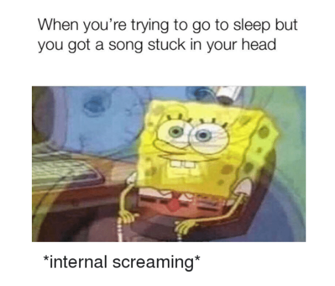
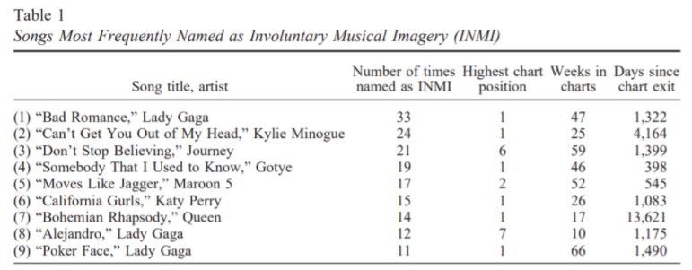

We’ve all been there—a song plays for the barest of moments, and much to our chagrin, firmly wriggles its way into our head, refusing to budge. I remember walking along a fairly quiet road in the evening, when someone’s phone blasted three seconds of a song, just before they fumbled to connect their earphones. That was it. I could not get the tune out of my head, and it was torturous. My friends would laughingly point out that I was humming it subconsciously, and the song haunted me awake and asleep, even becoming a fixture in some of my dreams. 
The likes of Edgar Allan Poe and Mark Twain have described their encounters with this stuck-song syndrome as ‘annoying’ in prose and poetry. But this repetitive experience isn’t true for *all* songs. In fact, experts have dubbed specially catchy tunes ‘earworms,’ a painfully apt moniker. A more technical term is involuntary music imagery (INMI), which is basically the repetition of a particular tune without conscious effort. This might sound like a strange name for an auditory experience, but research has shown that auditory perception and imagery share several common neural processing features, and imagery is a fundamental aspect of music cognition. Earworms can be triggered by external stimuli, and intrude into consciousness, making them a debilitating experience for those with increased musical awareness. A [study](https://doi.org/10.1177/0305735611406578) conducted on Finnish internet users found a high prevalence of INMI experiences, with the most common reported frequency being ‘everyday’. 68.9% of respondents even said that they experienced INMI while taking the survey.   

As for the kind of music that causes INMI experiences, the study showed that familiar lyrics dominated over instrumentals, with musicians hearing longer snippets while others heard one repeating segment. Situations in which it happened often were working alone, travelling, and exercising. Notably, competing auditory engagement, such as conversations, were a deterrent to INMI. However, in the [study](https://www.apa.org/pubs/journals/releases/aca-aca0000090.pdf) (Jakubowski et al.) examining melodic features of various pop songs, those with faster tempos and simpler melodic contours (making them easy to sing), were found more likely to be reported as INMIs. A common feature in most earworms, as mentioned in [this](https://doi.org/10.1348/000712609X479636) paper (Beaman and Williams), is that both the duration of the earworm as well as how long it lasts are much greater than standard estimates of auditory memory, implying that there is some long-term memory component involved. The paper also refers to earworms as one kind of intrusive thoughts, making a claim that “the earworms seem to behave like pathological intrusive thoughts, which only become so if their content is viewed as sufficiently unpleasant or distressing.” Patients diagnosed with OCD (obsessive-compulsive disorder), are [more likely](https://www.ncbi.nlm.nih.gov/pmc/articles/PMC4723199/) to experience earworms as harmful to their daily activities, and become distressed by them

<figure>
<figcaption align = "center">Source: Jakubowski, Kelly, et al. "Dissecting an earworm: Melodic features and song popularity predict involuntary musical imagery." *Psychology of Aesthetics, Creativity, and the Arts* 11.2 (2017): 122. Note: The author does not claim responsibility for any INMI experiences that may happen while reading the list.</figcaption>

</figure>

It is important to note that the conclusions drawn from these studies are still tentative, and there is still more scientific research to be done. Earworms can often be victim to speculative statements, but proper studies are required to back them up. 
Well, that’s that on earworms, but what do we do about them? Wegner’s theory of ironic mental control, put simply, says that any conscious attempt to remove a mental process (in this case, earworms) is unlikely to succeed, as thinking about the mental process re-presents it to the brain. Logically, this seems to make sense, however, everyone knows that trying to ‘not think’ about something often makes us think about it more. An effective method is to distract yourself with other songs, this article from [Harvard](https://www.health.harvard.edu/blog/why-you-cant-get-a-song-out-of-your-head-and-what-to-do-about-it-2017100412490) reports ‘God Save the Queen’ and ‘Karma Chameleon’ as the best tunes to cure earworms. In some cases, listening to the entire song might help in achieving ‘closure,’ thus ridding your mind of the earworm. By far the most bizarre way to rid yourself of these musical pests is [chewing gum](https://doi.org/10.1080/17470218.2015.1034142). It interferes with “hearing” the music. More broadly, any articulatory motor activity suppresses the recollection. The next time you’re afflicted by these musical menaces, grab some gum to get you out of the sticky situation.

-Shreya Venkatesan, B'19

Sources:  

1. Liikkanen, Lassi A. "Musical activities predispose to involuntary musical imagery." *Psychology of Music* 40.2 (2012): 236-256.  

2. Beaman, C Philip, and Tim I Williams. “Earworms (stuck song syndrome): towards a natural history of intrusive thoughts.” *British journal of psychology (London, England : 1953)* vol. 101,Pt 4 (2010): 637-53.   
3. Jakubowski, Kelly, et al. "Dissecting an earworm: Melodic features and song popularity predict involuntary musical imagery." *Psychology of Aesthetics, Creativity, and the Arts* 11.2 (2017): 122.
4. Euser, Anne Margriet, Menno Oosterhoff, and Ingrid van Balkom. "Stuck song syndrome: musical obsessions—when to look for OCD." *British Journal of General Practice* 66.643 (2016): 90-90.
5. Beaman, C. Philip, Kitty Powell, and Ellie Rapley. "Rapid Communication: Want to block earworms from conscious awareness? B (u) y gum!." (2015): 1049-1057.

Image Sources: [Spongebob meme](https://me.me/i/when-youre-trying-to-go-to-sleep-but-you-got-27a23356a86e4f9880d7303da20f5edb), [Cover image](https://unsplash.com/photos/PDX_a_82obo)
