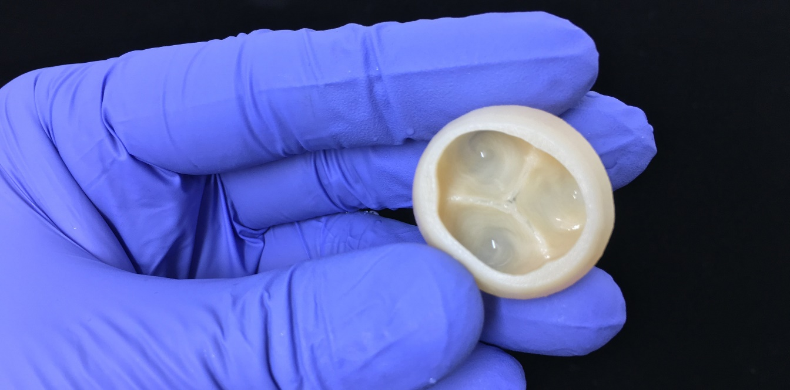

Most mainstream science is related to quantifying and exploring the
unknown, but ironically, the boundaries of science itself are limitless.
As you read this article, there are thousands of researchers all over
the world, hunched over hypotheses, conducting experiments, and either
celebrating small steps forward, or resignedly accepting failures. The
topics of research might be so narrow that we cannot fathom how it could
be important to us, however, therein lies the beauty of it, no discovery
is useless.

Recently, in an article dated 1st August, a team of scientists (Adam
Feinberg, Andrew Hudson, Andrew Lee, Dan Shiwarski, Joshua Tashman, TJ
Hinton, Sai Yerneni, Phil Campbell and Jacqueline Bliley) from Carnegie
Mellon University published a paper in *Science* regarding a
breakthrough technique allowing 3-D bioprinting of tissues using
collagen, the major structural protein in the human body. This
remarkable find takes us one step closer to printing an adult,
functioning human heart (which I'm sure most of this world could use).
Named Freeform Reversible Embedding of Suspended Hydrogels (FRESH), this
has helped achieve the most accuracy using soft, living materials.

The heart, like most other organs, is built from specialized cells held
together by an extracellular matrix, which is nearly impossible to
rebuild using present biofabrication methods. But these researchers have
shown that printing pieces of the heart using cells and collagen into
parts that function, like a valve, or a ventricle is possible. MRI data
of the human heart helped in creating the collagen and heart cells.
Collagen starts out as liquid and deforms very easily, so the scientists
put it into a support bath, formed the tissue layer-by-layer, allowed it
to solidify, before heating it to body temperature, that melts away the
bath, leaving an intact structure.

  
  <figcaption>Trileaflet heart valve printed using collagen and Freeform Reversible
Embedding of Suspended Hydrogels (FRESH) technology.</figcaption>

**Heart valve printed using FRESH**

The icing on the cake is the fact that the designs are open source,
which implies that anyone can have access to low cost, efficient 3-D
bioprinters. FRESH has varied applications in regenerative medicine, and
though there is much more fine-tuning left to be done, this paper is a
boon for patients awaiting heart transplants. All the Tin Men and Women
out there, rest assured, you won't need the Wizard Of Oz to give you a
new heart, just a FRESH perspective.

[Content source](https://engineering.cmu.edu/news-events/news/2019/08/01-feinberg-science-paper.html)

[Image source](https://3dprintingindustry.com/news/carnegie-mellon-advances-fresh-3d-bioprinting-to-rebuild-the-heart-159473/)
