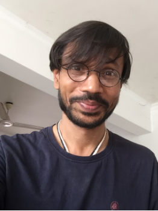
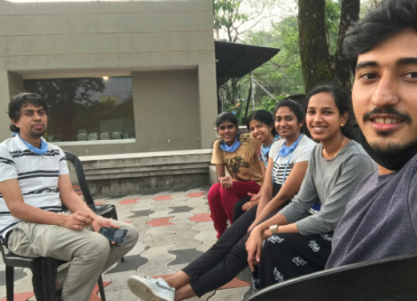
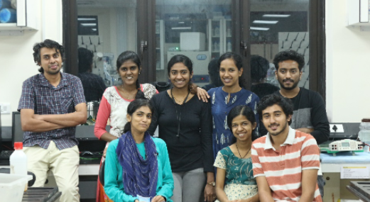

If you have visited IISER TVM anytime over the last decade or so, you’ve probably seen him. With his distinctive round glasses and chai cup, Dr. Kalika Prasad is a congenial presence wherever he goes, and is the perfect person to have a long chat about genetics with. He was an associate professor at IISER TVM till 2021, and is now an associate professor at IISER Pune. Dr. Kalika Prasad leads [The Lab of Regeneration](http://thelabofregeneration.in/Kalika_Prasad/index.html), which uses plant regeneration as a model to determine the basic principles and dynamics of self-organization. The group aims to discover mechanisms of cellular reprogramming and developmental plasticity in plants. 

Some animals are able to regenerate organs and repair damaged parts. All plants, however, can regrow lost parts as well as generate new individual plants from a few cells (regardless of which cells those are). While animals have to send specialized cells to the wound site in order to repair damage, in plants, the nearby cells must be reprogrammed for repair. Cells have continuous exchanges and conversions of energy into different forms and have thus been described as the perfect playground for self-organization. Self-organization is the emergence of  order in time and space in a system due to the overall interactions of its elements. These elements interact dynamically with each other and properties emerge that cannot solely arise from individual elements. It is found in physics, chemistry, and biology, and occurs in systems driven away from thermal equilibrium. It requires a constant input of energy to maintain order. 

Some of the questions the lab tries to answer involve the acquisition of pluripotent state, reconstitution of stem cells, dynamics of cellular behaviour, assembly of regulatory interactions and gene regulatory networks. The lab mainly uses live imaging of cellular events during regeneration. This live imaging lends itself to beautiful cover art that has been featured on several journals such as [Current Biology](https://www.sciencedirect.com/journal/current-biology/vol/25/issue/8) and Cell Reports. The lab also makes use of methods such as molecular biological tools, genetics, genomics, bio-imaging and computational modelling.

One of the models studied is tissue-culture-mediated de novo shoot regeneration. Using this, the group showed that three PLETHORA genes (PLT2, PLT5, PLT7) control shoot regeneration in Arabidopsis. The study of this model also revealed intermediate developmental phases of regeneration and provided insights about the mechanistic basis of regeneration. 

The lab’s work has been covered in national newspapers such as Deccan Chronicle and The New Indian Express. The Hindu also created a [video](https://www.youtube.com/watch?v=jIYtckjI568) featuring Dr. Prasad based on the lab’s work.

---

We had the opportunity to catch up with him for a quick chat. This interview of Dr. Kalika Prasad (KP) was conducted by Ira Zibbu (IZ) and Akshita Mittal (AM). You can listen to it [here](https://soundcloud.com/anvesha-content/lab-feature-interview-with-prof-kalika-prasad)
 
 

[IZ]: You joined IISER TVM in 2010—more than ten years ago, when it was still a young institute operating out of the CET campus. It has been a long time since then. So what was your last day as a part of the institute like, compared to your first day?

[KP]: First day, I would say I was lost when I entered. I didn't know what to do. The last day gave me a sense of completion. These ten years gave me immense things to learn, a lot to self-interrogate. After interacting with a bunch of amazing students and colleagues, it was entirely different. So, the last day was  different by the fact that it was the most meaningful day whereas on the first day I was quite lost. Having said that, on the first day, while I was lost, it was full of excitement. I was not aware about what I was going to take on because we were new and not that many facilities were in place. But we were very excited about doing our best, whatever was possible. So that kept me very excited and we kept going. Over time, I became mature perhaps, and learnt a lot. So it gave me a feeling of accomplishment. 

[AM]: What has been the most rewarding part of being a scientist so far?

[KP]: The most rewarding part is definitely to be part of students’ unexpected observations in the lab, which they make and you just become a part of them. One other rewarding part is interacting with young kids on a daily basis, with their questions which I could never imagine. Every day that I used to teach them or used to interact with them, each of those days was very rewarding because of the enthusiastic curiosity-based questions that I encountered and attempted to answer despite many of the questions not being in the literature. We used to get together to answer these questions with a logical mindset. The most rewarding part was the students and interactions with them.

[IZ]: As a professor and a PI, you have had to juggle both research as well as teaching. Was it hard focusing on research while continuing to teach? How did you manage to effectively do both?

[KP]: I never see research and teaching as two separate exercises. For me, you cannot separate them.If you look at it very carefully, teaching and research do have a lot of similarities in the sense that when you teach, you might be teaching the same course, but you learn over time. You encounter a number of new questions which allow you to think in a different direction. In research, you understand how each step needs to be taken carefully in terms of understanding, you go back to the class and teach even established facts there. Try to put yourself in a student’s shoes and then try to teach. Both are very much interconnected. I truly enjoy teaching because I truly enjoy being a part of research and amazing observations. So, for me, both of them are amazing. I cannot separate them and that’s why I like the IISER model because you learn, you teach; you go back and forth. Going back and forth is the most important thing, and they are connected. To answer your question, both are equally enthusiastic. However, I must say that what made me more enthusiastic is the teaching part.

[AM]: What was something unexpected that you learnt from your students as a professor?

[KP]: Well unexpected that I learnt from the students, let me think over it because there are many of those. I would say that what I learnt from my students is their perseverance, which I did not expect at this young age. My own lab people walked in from different backgrounds, and many never had access to the best colleges and universities. They walked with no background of the subject and some of the things I would have expected. But they worked from there and they persevered. When I was about to give up some things, I said, “It’s going to be very difficult.” They showed perseverance, they never gave up and that was amazing and unexpected. They never give up even till today. When I would say, “Look no problem, we can get away from this difficulty—let's think about an easier method.'' They would say,”No, we finally did it!” and that was always amazing. I am not going to name any particular person because each one of them comes with their own beauty and I am not going to be biased but I must tell you in general it was pleasant to work with their perseverance. When we used to send papers [to journals] and it used to come back for revisions and I would say, “Let’s sit and do these experiments,” many of my students would have already completed them. That was very unexpected, very very much unexpected for me. 

[IZ]: And finally what is one piece of advice you would like to leave the students of IISER TVM with?

[KP]: Only one piece, which I have given multiple times—never do science as just a profession, never for awards, never to simply advance your career, and never to get some money. Just do science as a quest, a longing to know. If you are doing anything in science, choose something you enjoy doing; something that you cannot sleep without doing, even on the weekends you want to just rush to do it. In this era of so much information that we get from the internet, we tend to immediately get attracted to particular fields in biology, and we think there is a lot of scope and become infatuated. I strongly recommend not to develop such short term interests. I would say just wait and see whether you have deeply fallen in love with that subject. Do in science whatever it takes and do what makes you joyful. Never do something for awards, marks or grades and you will see that in time one day you will be successful.
Though you only asked for one piece of advice, I’m taking the liberty to give a second piece of advice which is very important. I must give [it] to this generation and I feel it is my responsibility to share it. Never measure your success as compared to another batchmate or as compared to another colleague. Don’t think about who has a better GPA or who got admission in a better institution. Measure your success everyday. Today you are interviewing me and after some time you will do some other activities. At the end of the day, did you spend your day being your best; did you give your 100% in each and every activity that day? Never compare yourself with any other person. I am very hopeful that you guys will follow this otherwise in today's era the way people have been going for competitions it is easy to start comparing yourself with others. I would strongly discourage this. It is killing innovative science because many spend more time searching for awards. I can tell you this because I used to do a similar thing earlier. You know you asked me first about my first day at IISER TVM, but you did not ask me about what I did before that. During school days, the only thing I learnt and the only thing I knew was that I have to read, I have to study and I have to just get the marks. I continued this way in my BSc, and in my masters. To the best of my memory I have never stood second in my academic career. I got a large number of medals and awards but if you ask me if that journey was joyful, I would say no. Now that I am a PI, I decided that I will never apply for any awards. I completely enjoy the enthusiasm of the students now. My suggestion to you is to do science as a quest and as a longing to know. Follow your instincts, follow what you like the most and do what makes you joyful.

[AK]: Thank you for taking the time to answer our questions, it was a pleasure talking to you and we wish you all the best at IISER Pune.

[KP]: Thank you so much for your time. Because of these very strange times which we are going through, these pandemic times, I missed that one year of teaching somehow and it will always be empty. I enjoyed those ten years. I learnt a lot as I said and I grew in a different dimension but I will miss that one year where I could not interact with you guys, especially the basic fundamental courses which I love to teach. Over time with every batch, I learned a lot from you guys and we grew together. Well the world is small and I look forward to seeing you. Any time you come here [IISER Pune] never ask me whether  you can come and meet me, just pick up the number, call me and come. Any time. Thank you very much. 

---

No lab operates by itself; a wide variety of lab members including undergrads, graduate students, PhDs, post-docs, technicians and research fellows make up its heart and soul. The Lab of Regeneration is no different. Here is what the current members and alumni had to say:

**Bejoy Manoj, B'16 Major Project Student**  
I joined the lab as a major project student dating from August 2020 to April 2021. Besides the generation of few transgenic lines and other molecular biology and plant tissue culture experiments, my dissertation revolved around knocking out a cell-wall associated gene in an inducible manner at a particular developmental stage, using CRISPR-Cas9 mediated knockout to observe the dynamics and regenerative potential afterwards. It was an enriching experience to be a part of a prominent group working profoundly on plant stem cells and regeneration. My time there was sublime; the lab has helped me grow both scientifically and as an individual—It was astounding to be a part of Kalika’s brainstorming sessions and listen while he unfolds the intricacies of development. Looking back, I stumbled upon a ‘PLETHORA’ of memories. Even for the amount of time I have been there, they have made me feel like family and wholeheartedly helped me finish the daunting task of generating the knockout within the allocated time. Occasionally, sir sent over delectable tea with an earthy hit. Last day in the lab –-sendoff day.

**Yash Sondhi, Department of Biology, Florida International University, Miami, FL, USA**  
I got introduced to Dr. Kalika Prasad through a course on genetics at IISER-TVM. He taught us how to think critically and instilled into us the core tenets of doing good science. During my time at IISER-TVM, I was pursuing my own independent research on moths, but I really enjoyed his system of plant regeneration. On sharing this with him, he was very supportive and encouraged me to join the lab. I wanted to think about his system and about possible experiments, and could not have found a better lab to do so. I got the opportunity to interact with his graduate students and was amazed that he had created an environment where students were happy to try new experiments. Dr. Prasad always pushed us to ask questions and find the tools appropriate to answer them, even if they were outside our comfort zone. His training and mindset have been a major influence on how I approach new research problems. He was usually positive, and encouraged my cohort to excel both in and out of academia. He genuinely cared. He was always open to suggestions, even from undergraduate students in the lab, and to our surprise, he often incorporated some of these suggestions even if they seemed to defy the status quo. Dr. Prasad has always supported my endeavours to pursue a career in research.  My time at IISER-TVM would have not have been the same without him and I am always thankful for his help, mentorship and guidance.

**Dr.Abdul Kareem, Postdoctoral Research Associate,The University of Sydney, Australia & Swedish University of Agricultural Sciences, Sweden**  
I was the first PhD student of Prof. Kalika. I joined IISER-TVM in 2011. I was fortunate to be involved in establishing his research laboratory at IISER. It was both challenging and exciting to test multiple research hypotheses towards laying the foundation stones of the lab. Kalika’s outstanding supervision and support helped me to push the boundaries and to cherish the beauty of fundamental research. He loves to train his students to think out of the box and develop ideas. He always taught us the importance of curiosity-driven questions to understand the fundamental principles of developmental biology. His energy and enthusiasm for science were highly motivating. To me, the excellent experience from him is ever memorable. I hope he still loves green tea and dark chocolates! If you want to make a perfect green tea, please ask him how accurate you need to be while weighing Matcha green tea powder. 

**Dr.Kavya Durga Prasad, Postdoc, Department of Plant Systems Physiology, Institute for Water and Wetland Research, Faculty of Science, Radboud University**  
I joined Dr. Kalika Prasad’s lab in January 2013, as a PhD student with the INSPIRE fellowship. My doctoral research project provides a deeper understanding into the elusive mechanistic basis of what imposes a boundary on regenerative potential of a plant root and demonstrates that gradient expression of PLETHORA2 (PLT2) protein is the underlying cause. My stay in the lab of Dr. Kalika Prasad molded me into a skilled researcher with expertise in confocal imaging, plant tissue culture and various molecular biology techniques. The discussions that I had with Dr. Kalika Prasad enabled me to interpret the results more precisely and carefully. It was due to his encouragement that I was able to attend many national and international conferences. I really appreciate the support that he offered with funding, during the last phase of my PhD. I wish him great success in his academic career, at the new institute.  

**Dr.Dhanya Radhakrishnan, PhD , Assistant Professor, School of Biosciences, Mar Athanasios College for Advanced Studies (MACFAST), Kerala, India**  
Ph.D. at IISER Thiruvananthapuram was my first baby step into the world of research. This is where I explored and expanded my research skills. I consider it a privilege to have pursued my doctoral research in Biology at IISER TVM, which is undoubtedly on par with any world-class institution with respect to the infrastructure and its intellectual community. I had been equally fortunate to have worked under the supervision of Dr. Kalika Prasad, an internationally renowned plant developmental biologist. 
My research focused on understanding the molecular mechanisms that regulate natural as well as hormone-induced regeneration responses in plants. We used the model plant, Arabidopsis thaliana for our investigations. Plants are often subjected to injuries caused by biotic and abiotic factors. Though several studies have dissected the mechanisms of regeneration in the root, very few have probed the regulatory gene network directing regeneration responses in aerial organs growing in planta. One of my studies featured on the cover of the reputed journal Development, revealed a regulatory module that controls vascular regeneration in young leaves and stems. In another recent publication we also showed that these regeneration responses are dependent on the age of the injured plant, position and size of the injury inflicted.   

The highlight of my Ph.D. was that I got the chance to work with a number of plant regeneration systems and had the opportunity to collaborate with developmental biologists from around the world. Dr. Kalika is a stickler for details and he encourages his students to do the same. We were always reminded to settle for nothing less than the best microscopy images and to seek thought provoking novel concepts. Working with him has been truly a personally and professionally transforming experience. He constantly motivates us to push our limits and get out of our comfort zone. At the same time, he taught us to be humble and to genuinely appreciate the beauty of other’s research work just as much as we do our own. He has been my strongest mentor since I joined the lab.  

During my tenure, I have also been very lucky to have met and worked with a lot of great humans in my lab and at IISER. Everybody is approachable and constantly ready to lend a helping hand in times of need. My colleagues in the lab have particularly played a major role in making my stay at IISER memorable. We have supported and motivated each other along our separate journeys. Each individual comes with their own “superpowers”. We were always blessed to have a wholesome team wherein each individual contributed different skills. All these individuals complemented each other’s skills thereby contributing to the productivity of the lab and the goodwill between the members. We were more like a family who were there for one another 24x7. I cannot recall even one incident where a lab member refused to help me or anyone else in the time of a crisis. The credit goes to the atmosphere that our supervisor nurtured. He was always an enthusiastic and active participant in our research and publication process. But he is also our toughest critic. Therefore, we share the bitter-sweet amalgamation of publication experiences with our supervisor at a personal level. In one such incident, we had a lab full of happily crying people when one of paper with a particularly long publication process was chosen to be highlighted in the journal issue.
Clearly, Ph.D. is a tough commitment, the path is strewn with difficulties and turbulence. However, at the end of this journey, I believe that the experience has added new dimensions to my personality and nurtured me professionally.  I will forever be indebted to my supervisor and mentor, Dr. Kalika Prasad and my lab mates for being a part of some of my most cherished memories.

*We want to thank Dr. Kalika Prasad and the lab members and alumni for taking the time to talk to us. Introduction by Rithika Ganesan, Batch 19. Interview audio post-production by Ingole Prasmit Prahlad and Ira Zibbu, Batch 19. Write ups from lab members compiled by Meega Reji, Batch 19.*

 

