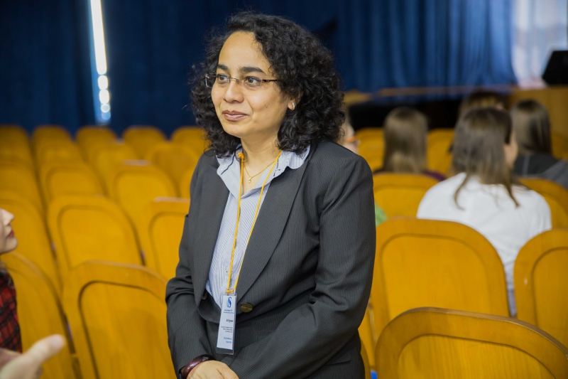

## Bish Paul 

  
Born and brought up in Hyderabad, Bish Paul (he/him) has been lauded as a scientist, but more importantly, as a creator of change. An openly gay, immigrant scientist-of-colour, his primary aim is to increase diversity in STEM and establish equal opportunities, especially at positions of power. After finishing his undergraduate degree at the University of Washington, where he majored in biology, he took some time off before his PhD, which is when his interest in social justice began. Slowly, he started exploring the intersection between science and social issues. During his doctorate, he worked at the Fred Hutchinson Cancer Research Center, focusing on developing a cure for HIV using gene editing techniques involving disrupting the viral receptor in T-cells using nucleases (better known as molecular scissors), and thus preventing the cells from being infected. He says, “I wanted my doctoral work to have social impact and not just be focused on molecules, a lot of my colleagues are already focused on molecules. What I saw that they sometimes lacked was that the molecules make up a person, […..] There is a lot of need to apply science to public policy and people’s daily lives.” The turning point came when he was offered a policy fellowship with the California Council on Science and Technology. Combining science with legislation showed him the huge impact he could have, and he started the first LGTBQ+ Staff Association in a state capitol in the USA. He is currently the policy manager for Washington STEM and hopes to continue being a tool for positive development.  

“Just as we need diversity in all spaces, we need diversity in the legislature as well. We need diversity of professions, we need scientists in the legislatures, not just people with law degrees. We need people of color. We need immigrants. We need queer people. All of those opinions and lived experiences need to be reflected in our laws and our policies.”

-Shreya Venkatesan B'19

Sources: (1) [University of Washington](https://www.grad.uw.edu/student-alumni-profiles/bish-paul-ph-d-16-molecular-cellular-biology/) (2) [Crosscut](https://crosscut.com/2019/04/queer-indian-and-immigrant-now-hes-creating-path-others-stem) (3) [Washington STEM](https://washingtonstemsummit2018201.sched.com/speaker/bish2) (4) [Bish Paul's Likedin](https://www.linkedin.com/in/bishpaul)

[Image source](https://ccst.us/people/2017-ccst-science-fellows/biswajit-bish-paul/)

## Grace Banu

A lot of discourse on LGBTQIA+ issues often fails to acknowledge the role caste plays in the discrimation people face. This statement is especially relevant to higher education institutions in India that are notorious for being casteist and transphobic. Against this backdrop, the work done by Grace Banu stands out. Grace Banu (she/her) is a dalit transgender woman who is an engineer, writer, political activist and founder of the Trans Rights Now Collective. She was the first transgender person to be admitted to an engineering college in Tamil Nadu. She has often recounted how she faced untouchability, caste-based discrimation and bullying for her gender identity at her school in Thoothukudi, Tamil Nadu. Grace Banu completed her diploma in computer engineering, and applied for college admissions despite being told that there was no provision for transgender people to study at government colleges in the state. She was accepted into Sri Krishna College of Engineering. Today Grace Banu is a proud mother to her adopted transgender daughters, of whom Tharika Banu was the first registered transgender person to clear class XII in Tamil Nadu. Grace strongly advocates for inclusion of reservation on the basis of caste and for transgender people in educational institutions and jobs as a means of upliftment for the respective communities. She has also stated the need for transgender people to receive salaries and stipends for the duration in which they undergo and recover from gender affirming surgeries. Today she continues to be a trailblazer, fighting for the rights of transgender and dalit people to receive education and seek discrimation-free employment.

-Ira Zibbu B'19

[Source](https://www.thinkcrrss.com/post/where-the-roads-cross-grace-banu-s-struggle-against-the-society)

(1) [Grace Banu's Twitter](https://twitter.com/thirunangai) (2) [A fundaraiser for trans people by Grace Banu](https://milaap.org/fundraisers/trnsgndrrelieftoothukudi)  

[Image Source](https://www.thinkcrrss.com/post/where-the-roads-cross-grace-banu-s-struggle-against-the-society)

## Sayantan Datta

Sayantan Datta (they/them) is a queer transgender scientist and a science communicator. After pursuing a Masters in neural and cognitive science from the University of Hyderabad, Datta is now actively working as a research scholar at TIFR, Mumbai. In the lab, they try to understand synaptogenesis (a process where synaptic connections form and mature) using Drosophila as the model organism. Their current work utilizes a combination of molecular biology and genetic methods to understand the effect of a gene in the Down Syndrome Critical Region for synapse development. Outside the premises of the lab, Datta is a science writer and activist who has tried to analyze the intersections between identity and STEM in India. Their major area of interest lies in critically evaluating science from a feminist lens. Right from their school years, Datta has worked with various media outlets and dabbled in science journalism. Their works have also been published in [Feminism in India](https://feminisminindia.com/author/sayantand/), [The Wire Science](https://science.thewire.in/author/sayantan-datta/), Economic, and Political Weekly, [The Life of Science](https://thelifeofscience.com/author/sayantan/), and IndiaBioScience among others. They have also identified that their quest as a writer is to find what keeps queer trans people in India from pursuing a STEM career, and also popularise the works of the fellow queer-trans people who are currently involved in the Indian science field.  

-Ashley Roby B'18

(1) [Sayantan's Twitter](https://twitter.com/queersprings?) (2) [Research Gate](https://www.researchgate.net/profile/Sayantan-Datta-2) (3) [Website](https://www.sayantanspins.com/)  

[Image Source](https://www.sayantanspins.com/)

## Dr Aqsa Shaikh

Dr. Aqsa Shiakh (she/her) is the first transgender person to become the nodal officer of a COVID-19 vaccination centre in India. She is a community medicine specialist, an associate professor at Jamia Hamdard, and an author. She is also one of the co-investigators in clinical trials on the Sputnik V COVID-19 vaccine. As the nodal officer of a vaccination centre at Hamdard Institute of Medical Sciences and Research (HIMSAR), she hopes to bring a positive change in society as a beacon of hope. 
She says  "I could be the first but I don't want to be the last. I hope the restriction and the 'otherization' that trans people face in society end soon so that they can be a part of mainstream society."
Dr Aqsa has actively made change possible by filing a petition at the Delhi Commission For Protection of Child Rights and was able to secure an order for a ban on unnecessary sex-change surgeries on intersex children. 
She is on the panel constituted by the Delhi government to look into transgender issues and the empowerment of transgender people.
She founded the Human Solidarity Foundation, an NGO that provided relief to thousands, especially during the lockdown. Dr Aqsa grew up in Malad, Mumbai, and is an advocate of having a supportive family and environment. Transgender screenwriter Gazal Dhaliwal was one of her inspirations and she emphasises that despite all the challenges she faced, being a woman has been a liberating experience.    

-Aishwarya PS B'18

[Image Source](https://www.outlookindia.com/website/story/india-news-the-pandemic-had-a-disastrous-impact-on-the-trans-community-dr-aqsa-shaikh/376293
)
  
## Arti Agarwal

Arti Agrawal (she/her) is a lesbian scientist and engineer. Born and raised in New Delhi, she did not have any positive exposure to LGBT+ communities or role models growing up. She has since worked with several organizations such as [SAGE](https://www.sciencegenderequity.org.au/sage-qa-with-dr-arti-agrawal-associate-professor-and-director-women-in-engineering-and-it-faculty-of-engineering-and-it-uts/), [500QS](https://500queerscientists.com/arti-agrawal/), and the [LGBTQ+ Faith Project](https://lgbtqfaith.tumblr.com/post/139044559462/arti-agrawal-i-am-a-lesbian-and-i-am-hindu-yet) to promote women and LGBT+ people in STEM. In 2009, she founded GWN Multicultural (GWN stood for Gay Women’s Network, and has been amended to LGBTQ+ Women’s Network), which is a safe space for LGBT+ professionals from different ethnic and cultural backgrounds. She received a PhD in Physics from IIT Delhi, then worked at the City, University of London. She is currently an assistant professor at the University of Technology Sydney. Her research focuses on computational photonics and photonic crystal fibres, and she uses modelling techniques to simulate the behaviour of light in optical devices. She is also the associate vice president of diversity for the IEEE Photonics Society.   
  
-Rithika Ganesan B'19  

[Arti's Personal Blog](https://artiagrawal.wordpress.com)  
  
[Image Source](https://500queerscientists.com/wp-content/uploads/2020/02/Arti-Agrawal-scaled.jpg)

