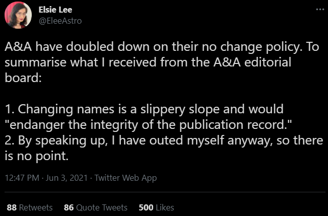
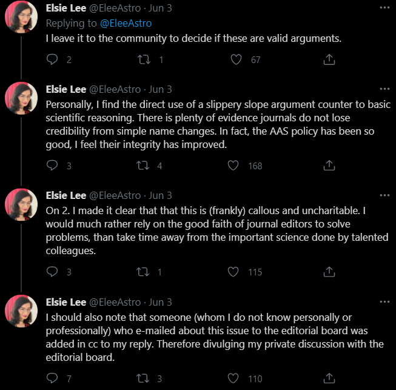

*Deadnaming* is the use of a the birth/former name of a transgender or non-binary person without their consent. It is seen as an aggressive and transphobic way of rejecting a person’s gender identity. Deadnaming includes both addressing the person by their deadname, or making remarks like “...[name], who used to be [deadname]...”. Deadnames are often associated with trauma, including harassment, violence, abuse, and assault. However, policies regarding name changes in publications promote the misgendering and deadnaming of transgender academics.

Recently, the journal Astronomy and Astrophysics came under scrutiny on Twitter after Dr. Elspeth Lee [@EleeAstro](https://twitter.com/EleeAstro) shared the following [thread](https://twitter.com/EleeAstro/status/1400350939530379264). 

Administrative barriers related to name changes for trans people are yet another form of systemic injustice. Legal name changes are expensive, and the names on email IDs, schedules, certificates, etc. also have to be replaced. These processes are made much harder for trans people due to prejudiced behaviour and bigotry. Several trans scientists have shared, in interviews and on social media, the hostility they have faced when approaching journals with name-change requests. 

For trans researchers, job-hunting becomes especially difficult when journals do not allow name changes on published work; if lists of publications have both names, they are essentially outed as trans and may face discrimination or harrassment. Not including papers from before their transition means that they appear less accomplished. 

COPE, the Committee on Publication Ethics, [maintains](https://publicationethics.org/news/vision-more-trans-inclusive-publishing-world) that name changes should be accessible to authors without legal, administrative, or other barriers, and should also be implemented quickly without drawing unnecessary attention to the name change. Many major publishers, such as Elsevier, Wiley, and IOP Publishing, have inclusive policies regarding name changes that are compatible with COPE guidelines (although whether they fully adhere to their policies is unclear). Most publications, however, when approached on the topic, are either unwilling to facilitate the change, or do so using counterproductive measures, such as adding errata that detail the correction, again essentially outing the author. 

Transgender, non-binary and gender diverse people are not the only ones put at risk by policies barring invisible name changes. The majority of name changes occur due to marriage or divorce. A small number of people attempting to avoid abusers also change their names. First and last names are not unique identifiers, whereas ORCID iD provides a unique digital identifier and solves the issue of the ‘sanctity of the public or historical record’. Researchers have [proposed](https://journals.plos.org/plosbiology/article?id=10.1371/journal.pbio.3001104) that ORCID could be a single platform to issue name change requests, which would not only allow trans scientists to minimize the number of people necessarily aware of their transition, but would also reduce the burden on scientists with numerous papers across multiple publications. 

A comprehensive system for invisible name change is absolutely necessary in order to support transgender and non-binary academics. Respecting preferred names and pronouns is essential to the dignity and safety of trans people, and to the core values of academia. Publications and other organizations, as well as cisgender academics, must work to promote those values. 

Following Dr. Lee’s tweets, Emily Hunt, a PhD student at Heidelberg University, started a working group for progress on the issue. The group published an [open letter](https://docs.google.com/document/d/1kECthbzbPd4nEdwnmzKEWRI9crfxTMydootf8CAZArI/edit) to the Astronomy and Astrophysics journal, and anyone can add their name to the [public version](https://docs.google.com/forms/d/e/1FAIpQLSfVhwsAXI37DTqUMPEnpN4aPou3L5VuDoW6R4Ha8VwjfZj1zQ/viewform) here. A&A last tweeted on June 4 that if any change to the policy occurred, it would be announced.   
  
 -Rithika Ganesan B'19  
   
[Image Source](https://images2.minutemediacdn.com/image/upload/c_crop,h_359,w_642,x_0,y_71/f_auto,q_auto,w_1100/v1555336090/shape/mentalfloss/istock_000028230856_small.jpg)
