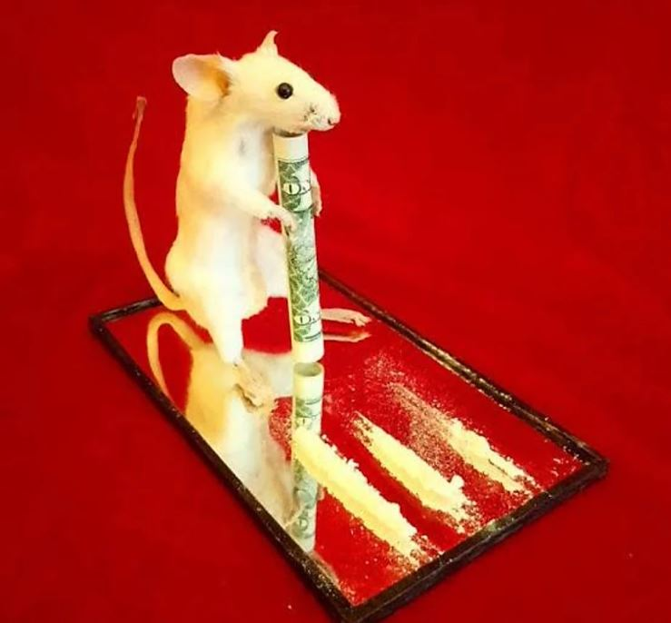

I never imagined I would title an article as absurdly as I have here, but we live in an era of clickbait, and *Mice, Miles Davis and Mounds of Cocaine* sounds far more interesting than *Music-induced Context Preference Following Cocaine Conditioning in Rats.*

This study, published in *Behavioural Neuroscience*, aimed to determine
the rats' preference for contrasting pieces of music (­Miles *Da*vis*'*
*Four (1954)* and Beethoven's *Fur Elise*) and to see if this preference
could be altered as a result of cocaine-paired conditioning. It also
sought to show that repeated administration of a drug in a particular
environment causes animals to subsequently develop a preference for that
environment. If Pavlov's experiment on dogs rings a bell (that pun was
*absolutely* intended), you may recall some basic ideas about classical
conditioning**.** This experiment utilized a tool called Conditioned
Place Preference (CPP) to evaluate the animal's liking for a stimulus
based upon the amount of time it spends in an area that has been
associated with that stimulus.

In order to determine their baseline musical preferences, the rats were
given control of their auditory surroundings by means of an apparatus
with two compartments fitted with speakers and motion sensors. When
motion was detected within a compartment, the song that corresponded
with that side of the apparatus was played. Thus, this system allowed
the rats to control the music they were hearing by moving between
compartments.

Through the means of this unusual (and slightly cruel) method, the
assessment indicated that rats preferred Beethoven to Miles Davis. Of
the 20 rats examined, eighteen of them showed a preference for
Beethoven, and only two showed a preference for Miles Davis. In a
similar way, it was determined that they preferred silence to Beethoven.

Now for the part that involves banned Schedule (II) Drugs; the rats were
subjected to two 60 minute conditioning sessions per day for four days.
12 test subjects received one daily conditioning session that paired
cocaine and the music they initially preferred least, and one daily
conditioning session that paired the preferred music with saline. 8
control subjects received saline during both conditioning sessions with
both music samples.

Like your stoner friend who insists that Pink Floyd sounds better when
one is high, the animals in the test group, receiving cocaine in
association with their least preferred music, showed an increased
preference for that music when compared to control animals. Rats
conditioned with cocaine spent significantly more time in the presence
of the cocaine-paired music than control animals during the final
preference test.

  

Anything for science! But seriously, don't do drugs.

*But why are we studying the music preferences of inebriated rodents?*
You, the reader naively asks. Firstly, it is wildly unethical to lock up
humans in a Plexiglass box and force them to listen to hours of the same
song on repeat while administering cocaine, hence we resort to animal
models to study the effects of such conditioning. Secondly, studies like
these uncover important information relating to drug usage and may help
to develop better treatments for addiction. Other studies have
demonstrated that like non-humans, humans also exhibit a preference for
a place previously associated with amphetamine usage. The authors of the
paper also suggest that if one were to pair a drug known to reduce
drug-seeking with a particular musical selection, it is possible that
the musical conditioned stimulus alone could then attenuate drug-seeking
behaviour and may prove to be a promising solution in the near future.

That being said the author of this article condemns cocaine use and
would like to quote the poster in the Indoor Stadium at IISER TVM: Don't
do drugs.

References:

1. [JE Polston, SD Glick, *Music-induced Context Preference Following
    Cocaine Conditioning in Rats,* Behavioural Neuroscience](https://www.ncbi.nlm.nih.gov/pmc/articles/PMC3144275/)

2. [Emma L Childs, Harriet de Wit, *Amphetamine-induced place preference in humans*, Biological Psychiatry](https://www.ncbi.nlm.nih.gov/pmc/articles/PMC2693956)
