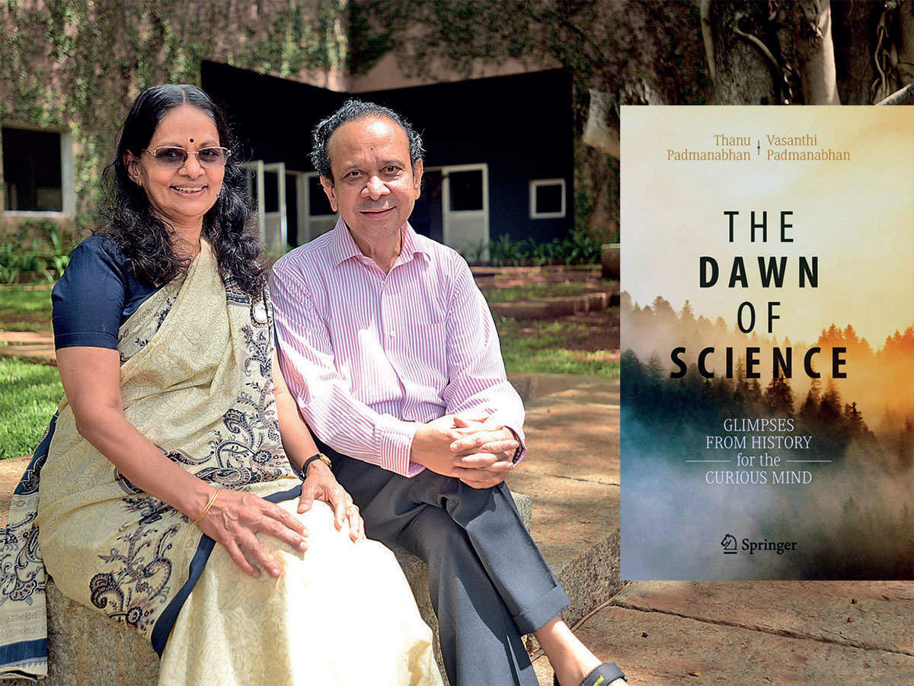

Having found the writings of historians on the early developments in science incomprehensible, a scientist writing its history was perfectly what I was looking for. To quote the authors, “The purpose of this book is to share the excitement the authors feel about the historical development of scientific ideas with the like-minded, curious, educated lay public. Needless to say, this is *not* a monograph on the history of science written by a couple of historians of science for fellow historians of science.” 

**The Book**

The Dawn of Science: Glimpses From History for the Curious Mind,* co-authored by Prof Thanu Padmanabhan and Dr Vasanthi Padmanabhan, was published in 2019 by Springer. Following the death of one of India’s finest physicists, Prof Thanu Padmanabhan, I immediately picked up the book as a tribute. Each of the 24 chapters focuses on crucial steps that eventually have led to science as we now know. While there could be many more chapters, making it a tome, they are chosen so that almost everything one can think of as a science can be connected back to one of the chapters. Some unique topics include the development of logarithms, the story of the calendar and the development of calculus in South India.
Throughout the review, due to a lack of a better word, I use the word “scientist” for anyone who contributed to developing scientific ideas. This includes people like Aristotle, who is more commonly called a philosopher.

**Praise and a bit of critique**

The chapters are entirely modular, allowing one to feel complete at the end of every chapter. Not just the chapters, even the figures and boxes are such that the reader need not interrupt the flow of the text. The boxes placed between the texts provide some very entertaining stand-alone material. At the end of each chapter, the figures outline the key people, events, and period the chapter talks about. The authors have made an effort to notify the reader whenever some idea presented has different viewpoints or is ambiguous. 
One of the features that make this book a good read is that it rests entirely on well-documented sources and provides an extensive list of references if one wants a better look. It balances being factual and enjoyable. Except for the choice of chapters, the book seems to be unbiased, and the authors largely do *not* interpolate the facts to misleading conclusions. It also throws light on the unsung heroes of science. The book provides an excellent account of how simple ideas influenced what was to come. 
The book’s cover portrays a generic mountain backdrop, and is one of the things I could not appreciate. Colourful pictures are one thing I missed. The spirit of modularity of the book results in the repetition of some text. While some parts may appear dull to the scientifically informed reader, it is vital to make the book accessible and enjoyable for a layperson.

**What’s in the book?**
The following are some quirks you will encounter in the book. I refrain from stating the examples as that would ruin the fun of realisation if one is inspired to read. 

- How some scientists did not realise the importance of their idea or discovery even till death. 
- How the appendix or footnotes of some books turned out to be more important than the book itself. 
- How false theories and some influential scientists led science astray by hindering scientific progress. 
- How some significant advancements in science fueled belief in wrong theories. 
- How some scientists missed the opportunity for fame due to misunderstandings or lack of proper communication. 
- How religious and societal interactions influenced the path of science. 
- How some fields developed from ideas developed for completely unrelated motivation. 
- How the celebrated intellectual geniuses were possessive of their contributions and took very crooked paths to retain the fame despite false beliefs. 

The chapters raise some essential questions, such as what fuels science? Is it curiosity or needs or just economic and social welfare? What makes a good scientist? Is it just the intellectual ability or a combination of circumstances, beliefs and sheer luck? What is good science? Is it the practicality of the ideas, or how much more science does the thesis lead to? 

The book provides historical contexts of the issues relevant even today, such as the problems in the accessibility of science, the importance of healthy relations between people in science and administration, the importance of documentation, the need to be open to ideas, and more importantly the importance of education and the ability to ask the right questions. It portrays scientists as normal human beings with emotions, weaknesses and problems to face with many examples from the lives of known intellectuals.

In all, the book can be compared to a good review article in scientific literature. The book’s content is welcoming to anyone with a high-school education in science. It is a perfect blend of science and history. It makes the reader realise how small steps and ideas that may seem insignificant at first can build the ocean of scientific knowledge. The book not only delves through the ups and downs in science but also makes one reconsider the aim of science and what matters in the long run.

Ravikiran S Hegde 

Batch 19

Cover Image: Springer Publications, India Times 
