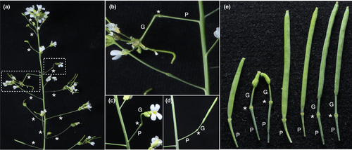
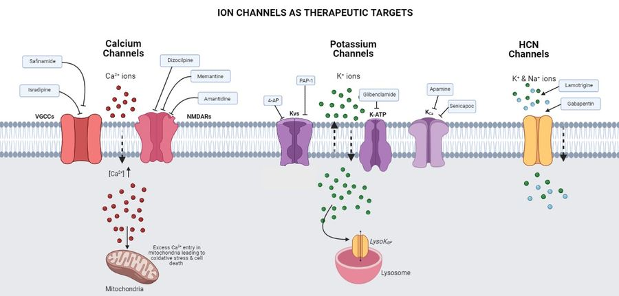
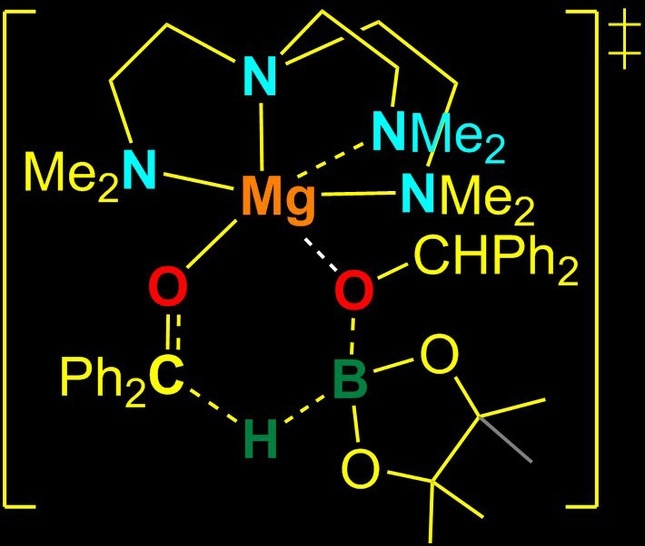

title: 'Research Highlights: December 2021'
author:  
date:  2021-12-20
tags:   
-research
-publications
slug: research-highlights-dec2021
excerpt: Catch up with the latest research here at IISER Thiruvananthapuram 

---

#### Cantil – a new organ or a morphological oddity?

*Ramesh Bondada, Dilsher Singh Kulaar, Imran Siddiqi, Ravi Maruthachalam*

This viewpoint paper addresses the recent discovery of a newly found 'organ' named cantil in the model plant *Arabidopsis thaliana*. In *Arabidopsis* mutants with delayed vegetative to reproductive transition, this structure has been seen in a short developmental period.  The cantil, named for its very cantilever-like role in bridging the pedicel (or the stalk) of the flower with the inflorescence axis, has no apparent biological significance. Its absence in most naturally occurring wild-type *Arabidopsis* accessions, and its appearance only in short day photoperiod conditions that prolong vegetative growth, have previously led to conclude that its formation is triggered by delayed reproductive transition rather than photoperiod. 
Since there has been no biological significance attributed to it, even in terms of adaptation, the cantil may be thought of as a 'morphological oddity' rather than a separate organ itself. The authors recommend being cautious of using the word 'organ' to describe cantils. They propose that cantils are essentially the same as nubbins (small angular stalks at nodes that have stopped growing). Nubbins have previously been documented by Henry et al.(2010) and were found to be one of the phenotypic consequences of aneuploidy syndrome. Furthering this, Ravi’s lab now shows the enhanced appearance of cantils in higher polyploids (with unbalanced chromosome dosage) of Arabidopsis generated by sexual polyploidization events. Cantils are most likely a result of the cumulative effect of genetics and the environment. Or, they could be atavistic structures that might have been evolutionarily advantageous long ago. The article ends on a note of friendly caution: cantil doesn't yet fit the criteria for being called an 'organ'.

<figure>
<figcaption align = "center">Illustration caption: Gynophores of the allopolyploid *Arabidopsis suecica* morphologically look like cantils. (a) An inflorescence from A. suecica shows the gynophores and the variable location of the floral scar. The rectangles are zoomed out in (b) and (c) to highlight the cantil-like appearance of the gynophores. </figcaption>
</figure>
[Source](https://nph.onlinelibrary.wiley.com/doi/full/10.1111/nph.17744)

#### Are ion channels potential therapeutic targets for Parkinson’s disease?

*Neha Hanna Daniel, Ananya Aravind, Poonam Thakur*

In this review paper, the authors highlight evidence that points out the role of various ion channels in driving Parkinson's disease (PD) pathology. The primary cause of Parkinson's disease is the progressive death of dopaminergic (DA) neurons in the substantia nigra region of the brain. Dopamine replacement therapies are used to treat the resulting motor problems. However, because these therapies do not prevent the underlying neurodegeneration, they lose their efficacy in controlling disease symptoms with time. Hence, novel treatment strategies that can delay or stop the neurodegenerative process are crucial. 

In the case of PD, the commonly studied therapeutic strategy is the maintenance of dopamine by giving drugs such as L-DOPA and the effects of ions and ion channels themselves are documented after that. Ion channels are one of the common therapeutic targets for many diseases and their role in other neurodegenerative diseases such as AD (Alzheimer's Disease), MSA (Multiple System Atrophy), epilepsy etc. is being studied. Drugs targeting these ion channels are also being made in recent times. Several membrane ion channels and transporters work together to control the cell-autonomous pacemaker firing activity of DA neurons and that is critical for sustaining dopamine levels during baseline activities. Dysfunction of any of these channels affects their intricate balance and breaks down the ionic homeostasis. Here the function and contribution of several classes of ion channels to the PD progression such as Calcium (Ca2+) channels, Potassium (K+) channels and HCN channels are also addressed.

<figure>
<figcaption align = "center">Illustration of Calcium, Potassium and HCN  ion channels as therapeutic targets</figcaption>
</figure>

This paper discusses the various medications or compounds that target ion channels and have shown neuroprotective potential in in-vitro and in-vivo models of Parkinson disease. It also refers to the current clinical status of several ion channel-targeting therapies in the context of Parkinson's disease. The  authors emphasise the importance of ion channels in driving disease pathogenesis by considering the accumulating evidence that supports the utility of ion channels as a therapeutic target for PD. However, more  insights into the alteration of ionic homeostasis with the progression of the disease are required to effectively use ion channel modulation for therapeutics. The paper ends by suggesting that a proper understanding of the interconnected mechanisms that control the expression and activity of different channels will pave the way for therapies that provide much-needed relief to PD patients.

[Source](https://doi.org/10.1016/j.neuro.2021.10.008)

#### Examining the Transient Dark State in Protein-Quantum Dot Interaction by Relaxation-Based Solution NMR

*Muhammed Shafeek, Oliyantakath Hassan, Sanoop Mambully Somasundaran, Muhammed Bilal Abdul Shukkoor, Shine Ayyappan, Arshad Abdul Vahid and Vinesh Vijayan*

In this paper, the authors discover the potential application of contemporary NMR techniques in probing the interactions of biomolecules with nanometer-sized particles like Quantum Dots (QDs). Quantum dots are semiconductor particles with conduction band electrons, valence band holes and excitons (electron-hole pairs) in a confined space. Because of this confinement of electricity-carriers, the quantum dot has a distinct energy level and the electrons within this quantum dot should occupy an energy level that ‘fits’ inside it. When the quantum dot comes into contact with a light or electricity source, electrons occupying this energy level emit photons of a certain wavelength. This explains why quantum dots have unique optical properties and are used in medical imaging, live-cell labeling, fluorescent immunoassays, and drug delivery. However, when exposed to cellular environments, QDs interact with the biomolecules, especially proteins. This interaction may alter their luminescence and subsequently, cellular damage or cell death can take place. Hence, it is necessary that we study the dynamics of QD-protein binding and design QD based delivery systems accordingly. To achieve this goal, scientists had earlier tried biophysical techniques like conventional NMR spectroscopy. But the QD-protein bound states weren’t visible or detectable in such measurements due to the high molecular weight of the whole system. In other words, those states are the ‘dark states’ in the NMR spectrum. The team led by Dr.Vinesh Vijayan made use of the very modern relaxation-based solution NMR approaches to study these dark states at atomic resolution.

<figure>
<figcaption align = "center">DEST/ΔR₂ technique analysis of the ¹⁵N-labeled Ub in the presence of 50 μM CdTe QDs at a spectrometer frequency of 700 MHz.
</figure>

They adopted three relaxation-based solution NMR techniques: DEST, lifetime line broadening, and exchange-induced chemical shift. ¹⁵N-labeled Ubiquitin (Ub) and MSA-capped CdTe QDs were the candidates for protein and QD respectively. They determined that Ub undergoes fast exchange with CdTe QDs and binds directly to the QD surface. The QDs evidently established an electrostatic interaction with residues on the positively charged surface of Ub protein. Even the protein was found to stay for a longer time on the surface of the CdTe QD than lipid nanoparticles, suggesting the higher affinity of Ub towards the Quantum Dot. 

[Source](https://pubs.acs.org/doi/10.1021/acs.jpcb.1c04853)

#### (Me₆TREN)MgOCHPh₂[B(C₆F₅)₄]: A Model Complex to Explore the Catalytic Activity of Magnesium Alkoxides in Ketone Hydroboration

*Ankur, Ramkumar Kannan, Raju Chambenahalli, Sumanta Banerjee, Yan Yang, Laurent Maron, Ajay Venugopal*

<figure>
<figcaption align = "center">(Me₆TREN)MgOCHPh₂][B(C₆F₅)₄] complex used as the catalyst.
</figure>

In this paper, the catalytic role of Magnesium alkoxides in ketone hydroboration is discussed. As one may recall, hydroboration is the addition of a hydrogen-boron bond to C-C, C-N, and C-O double bonds, as well as C-C triple bonds. The authors observed that, [(Me₆TREN)MgOCHPh₂][B(C₆F₅)₄] complexes can show efficient catalytic activity in such hydroboration reactions. In the reaction they studied, the pathway connecting the substrates and products was of concerted type, meaning that bond breaking and bond making occured in a single step. Using other experiments and calculations like Density Functional Theory (DFT), the transition state of the reaction was also examined in terms of energy and structure. Apparently, the transition state was a six-membered chemical entity involving Mg−OCHPh₂, B−H, and C=O bonds. The Turnover Frequency (TOF) is a good tool to compare active site efficiencies of different catalysts. Therefore, the TOF parameter was also analyzed for [Mg(OCHPh2)2] and it was found that this active site of the model complex catalyst can provide surface for approximately 59,400 reactions per hour. In addition, the reaction was carried out in the presence of other highly reactive functional groups to see whether the catalytic activity will be hindered or not. The catalysis was left undisturbed due to the non-existence of a metal hydride intermediate, indicating the high stability of [Mg(OCHPh₂)₂] towards C=C, −OH, −NH₂ and −NO₂. 

“The work primarily carried out by Ankur, Batch 17 BS-MS student at IISER Thiruvananthapuram, explores a concerted carbonyl hydroboration mechanism involving Mg―O, B―H, and C=O bonds. Homoleptic magnesium alkoxides catalyze ketone hydroboration with turn-over frequency (TOF) reaching up to 59,400 h-1 and exhibit exceptional functional group tolerance. This TOF is so far the best observed in a main group catalyst without the involvement of a metal hydride intermediate. The newly proposed mechanism finds general applicability in magnesium alkoxides and stimulates interest in exploring other metal alkoxides in reduction chemistry.” - Dr. Ajay Venugopal (one of the authors).

This work will be showcased in a special collection on "Main Group Catalysis"  in the European Journal of Inorganic Chemistry and also will be highlighted in the front cover of the published issue.

[Source](https://chemistry-europe.onlinelibrary.wiley.com/doi/epdf/10.1002/ejic.202100651)

#### Planar hexaphyrin-like macrocycles turning into bis-BODIPYs with box-shaped structures exhibiting excitonic coupling

*Planar hexaphyrin-like macrocycles turning into bis-BODIPYs with box-shaped structures exhibiting excitonic coupling*

In natural processes like photosynthesis, the strong excitonic coupling (observed when the excited states interact with each other) among pigments is achieved through their long-lived quantum coherence between pigment-protein complexes. This has allowed such natural systems to obtain excellent quantum efficiency. Researchers have been trying to mimic such excitonic couplings to enhance the light-harvesting efficiency of transition dipoles of synthetic chromophores by tuning both distance orientations. And one such successful attempt is BODIPYs. BODIPY dyes (boron dipyrromethene and its analogues) are a hallmark discovery in the arena of fluorescent sensing. BODIPYs belong to the class of fluorescent dyes that are constituted by dipyrromethene complexed with a disubstituted boron atom (BF2). They stand out due to their excellent photophysical properties and shape-independent high fluorescence quantum yields. However, their utilisation has run into problems caused by small Stokes shifts and inner filter effect.

One among the successful strategies to utilise these BODIPYs is by complexing BF2 with expanded porphyrins to synthesize cyclic BODIPYs. These cyclic systems exhibit excitonic coupling owing to their interaction between transition dipoles. 

Carbazoles are molecules that can be diligently used to modify expanded porphyrins. The advantage of incorporating carbazole molecules lies in their similarity to pyrrole, increased electronic conductance and high emission and chemical stability. The group led by Dr Gokulnath incorporated all the above key elements to synthesize and investigate carbazole embedded hexaphyrin-like macrocycles and their corresponding bis-BODIPY complexes. They used one of their previously reported molecule to synthesise the target macrocycles. Out of the two molecules synthesised, one of them showed large fluxional behaviour at room temperature owing to their interconversion between imino and amino pyrroles. However, in the other macrocycle they worked with, such fluxional behaviour was minimized due to the sterical hindrance from meso-mesityl groups. 

The paper discusses in detail the synthesis and dynamics of their newly synthesized class of carbazole based hexaphyrin-like structures and their bis-BODIPY arrays. The calculations arrived from differential voltammetry measurements were found to be consistent with the DFT calculations, and they both indicate a strong intramolecular electronic interaction between the BODIPY subunits. 

[Source](https://pubs.rsc.org/en/content/articlelanding/2021/cc/d1cc04403f)

*School of Biology highlights compiled by Akhila S, Suhana Nujum and Meega Reji. School of Chemistry highlights compiled by Hruidya C Babu and Ashley Roby.*