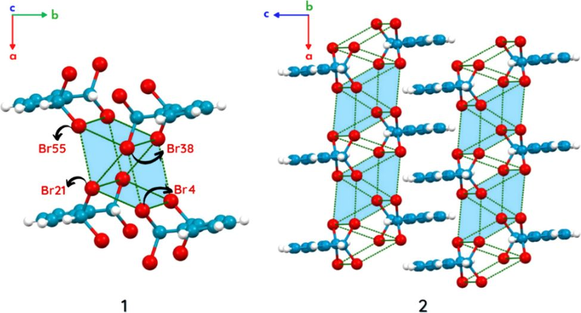
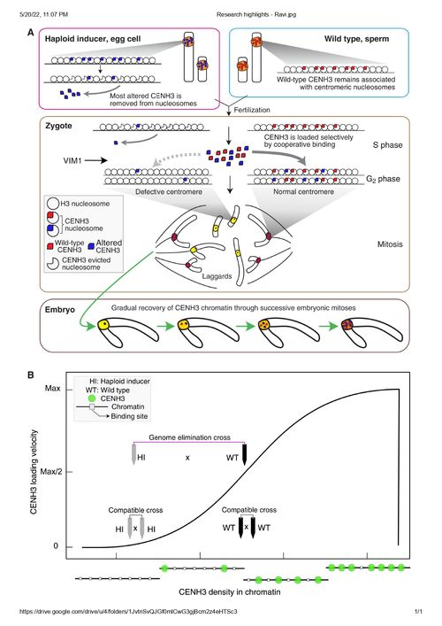
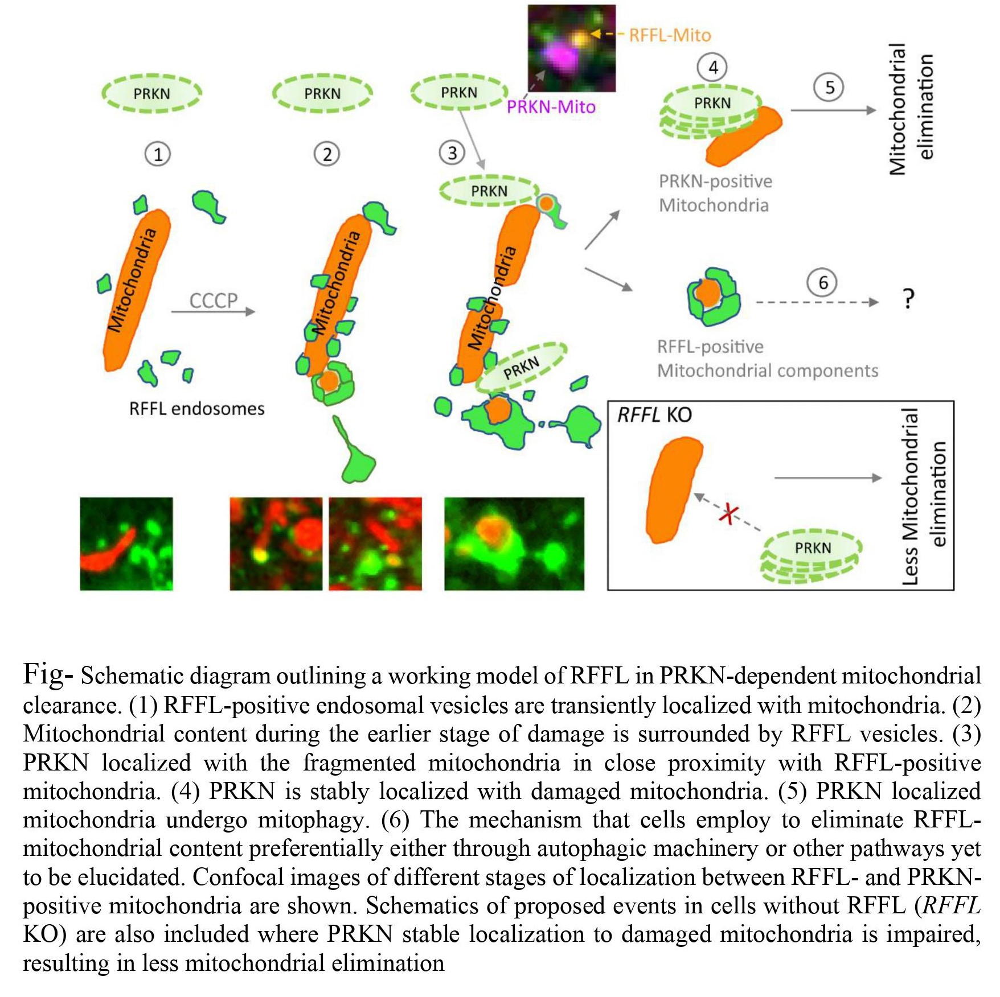

#### Giant Supramolecular Synthons via Cyclic Halogen···Halogen Contacts in Substituted o-Xylenes

*Nanditha G. Nair, Krishna Prasad, Hruidya C. Babu, and Mahesh Hariharan*

Crystals are composed of highly ordered microscopic structures called crystal lattices that extend in all directions in the three dimensional space. Within a crystal structure, we can define certain structural units called synthons that are formed with the aid of intermolecular interactions. Often, the term ‘supramolecular synthons’ is used in literature since synthons contain all inherent information required for many molecules to assemble into complex supermolecules. Geometric linking and mutual interference between adjacent synthons mediated by various kinds of inter - and intramolecular interactions are crucial for the formation of supramolecular assemblies. In this work by Mahesh and co-workers, the role of interhalogen interactions in directing the synthon pattern in xylene (dimethylbenzene) and its derivatives is analyzed. Among all intermolecular interactions studied in the field of crystallography so far, halogen bonding is the least explored category. According to the paper, “halogen bonding is an exceptional candidate, which has not been exploited to its full potential yet.” Halogens like bromine and iodine can form furcating (branching), hypervalent, and non-covalent interactions with other halogens, which we call as halogen bonding. There are different types of halogen bonding (types I, II and III), classified on the basis of the interaction geometry. The authors report the first evidence of giant, cyclooctameric Br8 synthons formed through hypervalent, inter and intramolecular Br···Br contacts in the crystal structure of α,α,α′,α′-tetrabromo-o-xylene. They also crystallized a new polymorph (another crystalline form) of tetrabromo-o-xylene, which had a unique synthon pattern characterized by Br4 synthons. By means of computational software like NEDA, SAPT-EDA and IQA for energy decomposition analysis, the team found out the attractive and repulsive components of total interaction energies of these synthons. While NEDA pointed out polarization as the major contributor to the attractive electrical components, IQA indicated a stabilizing exchange−correlation component for the Br···Br interaction energy. Exchange–correlation energy, or EXC, is one fraction of the total energy that captures all many-body interactions required to stabilize a structure. SAPT-analysis also showed that an appreciable stabilization of the intermolecular interactions come from dispersion forces. Even though the methods of energy decomposition were different in each case, it was concluded that non-electrostatic components primarily participated in stabilizing the halogen interactions. Furthermore, the stabilizing nature of halogen···halogen contacts were clear from another visualization tool for intermolecular interactions called NCI analysis. Despite the fact that most of the studied interactions had interaction ranges outside the sum of van der Waals radii, they could ‘collectively’ stabilize the supramolecular architectures. Therefore, the IUPAC criterion for defining a non-covalent halogen interaction, that is, “interaction distance should be less than the sum of vdW radii of participating atoms”, should not be always true while rationalizing various intermolecular interactions and the mechanism of crystallization. Finally, Hirshfeld surface analysis of crystals of o-xylene and its brominated (mono-, di-, tri- and tetra-substituted) derivatives revealed an increase in percentage of Br···Br interactions and π-stacking in the crystal with increase in the number of bromine substituents in xylene. Placing a polar group such as a halogen atom in the parent backbone has a similar effect as preventing the CH···π interactions and enhancing the π-stacked geometry.

<figcaption align = "center">The giant Br8 synthon found in the polymorph of tetrabromo-o-xylene visualized using Mercury </figcaption>

[Source: Crystal Growth and Design, American Chemical Society](https://pubs.acs.org/doi/full/10.1021/acs.cgd.1c01397)

#### Epigenetically mismatched parental centromeres trigger genome elimination in hybrids

*Mohan P. A. Marimuthu, Ravi Maruthachalam, Ramesh Bondada, Sundaram Kuppu, Ek Han Tan,  Anne Britt, Simon W. L. Chan and Luca Comai*

Uniparental genome elimination is the post-zygotic loss of one parental set of chromosomes. The mechanisms that cause it are poorly understood. In this paper, the authors propose a mechanism for how CENH3 (centromeric histone 3)  polymorphism results in forming a distinct centromere and how this leads to genome elimination. CENH3 is a vital histone variant (proteins that substitute for the core canonical histones H3, H4, H2A, H2B in nucleosomes in eukaryotes) that determines the identity of centromeres. This variant forms specialised chromatin on which the kinetochores assemble. The authors crossed CENH3 depleted centromere parent (HI) with the wildtype (CENH3 rich centromeres)(WT) parent. They observed that the loading of CENH3 and other essential centromere proteins happens in the progeny only on CENH3 rich chromatin that the wildtype parent contributes. They hypothesise that this preferential loading could be caused by cooperative binding kinetics favouring centromeres with a high density of CENH3 nucleosomes. Due to this preferential loading, the HI chromosomal missegregation occurs in the following mitosis due to a weak centromere. Many zygotes, after this cross, eventually form aneuploid or diploid  suggesting a potential model for centromere recovery. They also found out that VIM1, an epigenetic factor, is required to stabilise CENH3 and the null mutants of VIM1 led to an increased haploid frequency. This HI system is difficult to replicate in other crops or plants mainly because of the species-specific variations in the mechanisms that regulate CENH3.  This paper has taken another step towards understanding the mechanism of genome elimination which can further be put into a lot of biotechnological applications and expedite plant breeding and genetics. 

> Studying this (uniparental genome elimination) process is technically challenging as this process occurs immediately after fertilisation, and subsequent embryonic divisions. Furthermore, embryogenesis that leads to the development of embryo proper occurs inside the sporophytic tissue of the ovule and thus we have to rely on fluorescently tagged proteins along with real time microscopic imaging to visualise the events that are hidden inside the ovule tissues. The paper in Science Advances is an effort worth more than 10 years to decipher the fact that "epigenetically mismatched parental centromeres trigger genome elimination in hybrids" which goes by the same title.  How hypomethylated centromeres enhance UGE and what are other molecular players involved in this process still remains an open question which needs to be addressed in future to better understand the mechanism.” said Ravi M., one of the study authors. 

<figcaption align = "center">A) Preferential CENH3 loading
B) Plot of CENH3 loading velocity on chromatin as a function of CENH3 density in chromatin
 </figcaption>

[Source: Science Advances, AAAS](https://www.ncbi.nlm.nih.gov/pmc/articles/PMC8604413/)

#### Endosomes facilitate mitochondrial clearance by enhancing parkin recruitment to mitochondria.

*Rishith Ravindran, Anoop Kumar G Velikkakath, Nikhil Dev Narendradev, Aneesh Chandrasekharan, T R Santhoshkumar, Srinivasa M Srinivasula*

Parkinson's disease (PD) is the second most common neurodegenerative disease. PD affects dopamine-producing neurons, leading to several motor-related symptoms in patients including tremors, trembling of hands, arms, legs, and jaw, slowness of movement, poor balance and speech difficulties However, very little is known about its cause and to date, no cure is available. The unavailability of a cure can also be attributed to the different pathologies underlying PD.

Mutations in several genes are reported in PD patients. PRKN is one such gene reported to be mutated in several patients and is widely expressed in various brain tissues. Mitochondrial homeostasis is critical for cells and the turnover of mitochondria is maintained by the process of mitophagy. Most of the reported pathologies of PD have shown defects in this process, causing reduced clearance of damaged mitochondria. Mitochondria are the powerhouse of the cell, so any damage to the mitochondria can lead to the generation of reactive oxygen species (ROS) and may lead to cell death. Hence, the loss of neurons during neurodegenerative disorders could be partly due to the damaged mitochondria. The breakthrough discovery came when it was shown in the cell line system that PRKN(a mitochondrial associated E3 ubiquitin ligase) upon mitochondrial damage, could translocate from the cytosol to mitochondria and assist in its clearance through a process called mitophagy. However, the regulatory molecules involved in the recruitment of PRKN to mitochondria are poorly understood.

This paper unravels the role of RFFL, an endosomal ubiquitin ligase, to promote the recruitment of PRKN on damaged mitochondria, thus leading to the clearance of damaged mitochondria. It further provides insights into the cross-talk between endosomal machinery and mitochondrial homeostasis, which is currently an active area of research in mitochondrial quality control. 

The RFFL endocytotic vesicles were recruited to the fragmented mitochondria soon after inducing cell stress. This recruitment precedes PRKN recruitment on the damaged mitochondria, facilitating recruitment of PRKN and increasing clearance of the damaged mitochondria. This phenomenon was defective in cells that lacked RFFL.
The paper also addresses the critical RFFL site required for the association with parkin. Defects in the palmitoylation site of RFFL failed to associate with endocytotic vesicles and delayed parkin recruitment on damaged mitochondria leading to a significant decrease in damaged mitochondrial clearance. These key data and other results led the authors to propose that RFFL-positive vesicles act as a primary step to prime the damaged mitochondria and such a priming results in the recruitment of PRKN and later in the degradation of the same.

This study will pave the way for a complete understanding of how PRKN is recruited to the damaged mitochondria, and future research may lead to the discovery of novel therapeutic approaches for the cure of PD.

[Source: Autophagy](https://pubmed.ncbi.nlm.nih.gov/35373701/)

*School of Biology highlights by Vishwathiga J. and Parul Jain. School of Chemistry highlights by Hruidya C. Babu*

