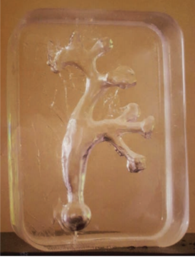

We all know that science can be a little tedious at times, leaving us a
bit disillusioned. That is why we rely on research such as the
following, to remind us of how exciting and adventurous scientific
methods can be!

On the 13th of September, the 2018 Ig Nobel Prizes were awarded at
Harvard University. For those of you who do not know, the Ig Nobel Prize
is awarded "For achievements that first make people LAUGH, then make
them THINK." This year, the prize in the medicine category was bagged by
researchers who demonstrated how roller coaster rides can aid in the
passing of kidney stones.

Kidney stones are typically caused due to a lack of adequate water
intake, resulting in the accumulation of minerals on the walls of the
kidney. Heredity and diet also play a major role. They tend to form
sharp structures that can lead to extreme pain, or in other cases pass
through the urinary tract unnoticed.

The prize was awarded to two American scientists: Marc Mitchell and
David Wartinger. It was an observation by one of Professor Wartinger's
patients who prompted this unusual discovery. After 3 consecutive rides
on the Big Thunder Mountain Railroad roller coaster at Walt Disney
World's Magic Kingdom theme park in Orlando, Florida, the patient
reported passing kidney stones each time! Similar incidents were
reported by other patients who rode the same roller coaster.

Curious, the researchers decided to explore this intriguing phenomenon.
To do so, they constructed a model of the insides of the kidney using
silicone and used it as a surrogate to study the effects of the roller
coaster ride. The model contained urine and three kidney stones of
different sizes which were passed out by the patient whose kidney was
used as the template to create the silicone model.

  

***The Silicone Model***

The model permitted the researchers to monitor the movement of the
kidney stones after exposure to the roller coaster rides as it was
transparent. It was taken on a total of 20 rollercoaster rides. The
researchers observed that the stones had a passage rate of 64% when it
was seated at the rear end, which is almost 4 times the passage rate
when seated in front, indicating that the rear-end of the rollercoaster
is most optimal for our purpose. The probability of a patient passing an
average-sized kidney stone spontaneously, without treatment or
alternatives such as this ride, is only 1%. Therefore, you can see how
beneficial these rides can be!

Thus, roller coasters can aid in the passage of kidney stones, but it is
not a concrete solution to the problem (no pun intended!). Patients who
were likely to experience severe pain due to oversized kidney stones and
the extreme forces of the ride were advised to not ride the
rollercoaster.

Kidney stone re-formation after clinical treatment is reported to be 50%
after 10 years due to small fragments that are not passed. These small
fragments accumulate and grow in size over time, leading to the
recurrence of symptoms. The researchers advise that a moderate intensity
ride after clinical treatment could help dislodge the accumulated renal
stones; a few visits to a nearby amusement park can do wonders for
patients.

Kidney stones affect 10-12% of the population in industrialized nations.
It is important that we are aware of the implications of this condition
as it could lead to severe pain and blockage in the kidneys.

These researchers have perfectly demonstrated how fun and unorthodox science can be. Sometimes, the
answers are not in the safe surroundings of our labs; instead, they are
out there in the open waiting to be explored. Get out there and make
your quirky discoveries!

For the students of IISER who do not have the luxury of nearby roller
coaster rides, the notorious KSRTC bus rides will be just as good.

[Source](http://broomedocs.com/wp-content/uploads/2016/10/roller-stone.pdf)

[Link for published
copy](https://www.anveshablog.com/post/rolling-stones-1)

(The image was taken from the article)
