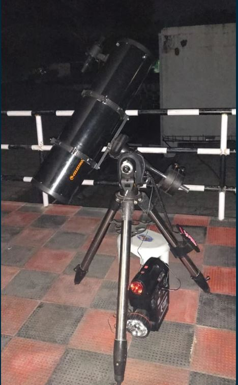
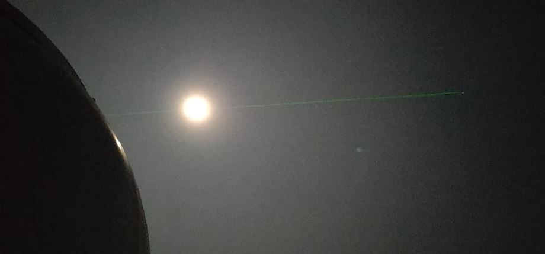

The 19th of January 2019 held an exciting day for some very fortunate
students. Anvesha had successfully pulled off a stargazing event at the
Indian Institute of Space Science and Technology (IIST). Our very own
professor Dr.Vinayak Kamble, using his contacts, blessed us with an
opportunity to take 50 of our most enthusiastic students on a round trip
to IIST to use their telescopes and witness some incredible celestial
phenomena.

Upon our arrival at IIST, we were greeted by Dr.Sarita and a few of her
students on the roof of the Science Block. For about half an hour hence,
while the telescopes were being set up, she spoke to us about how
astronomy evolved from its humble beginnings to being an indispensable
branch of science without which all our navigation systems will be
rendered useless. She spoke to us about how we define time based on the
stars and how we can find out the speed with which we move through space
where everything appears to be a random movement to the untrained eye.
Of course, as any amateur astronomer would do, we first saw the Moon,
with all the craters and deformities it had amassed during its violent
past.

  
  <figcaption>8 inch Celestron telescope, through which Moon and Mars were viewed</figcaption>

By the time all of us were done with the Moon, the 14-inch diameter
telescope already had its lens set on the M42 nebula (or) the Orion
nebula. Dr.Sarita then explained it to be a region that has been
intensively studied for star formation. Soon after, we trained our
8-inch telescope at M37 (Messier 37 cluster). The cluster wasn't
perfectly visible because of the hazy sky and the bright moon but it
still was incredible to see. Just when we thought we were done, one
among the party, one with a sharp eye, spotted Mars. By the power of the
14-inch telescope, we marvelled from afar the great red planet that is
now the centre of attention for Elon Musk.

  
  <figcaption>14-inch telescope with its laser viewfinder focusing on M37 and a bright moon in the background</figcaption>

During the entire period, Dr.Sarita took questions from our students and
answered all without fail. For each question asked, we not only learnt
the answer to that question, but also the meaning behind those answers
and what they could mean for us. Her vast knowledge of astronomy made us
realise the true endless wonders of science and exploration.

Finally, when our hunger had peaked, we took a walk about the campus in
search of the mess and upon finding it, had a hearty dinner. Soon we bid
farewell to IIST as the end of our adventure grew near. All the students
who came were captivated by the night sky and the mysteries that the
universe beholds. It was truly an eye-opening experience.
