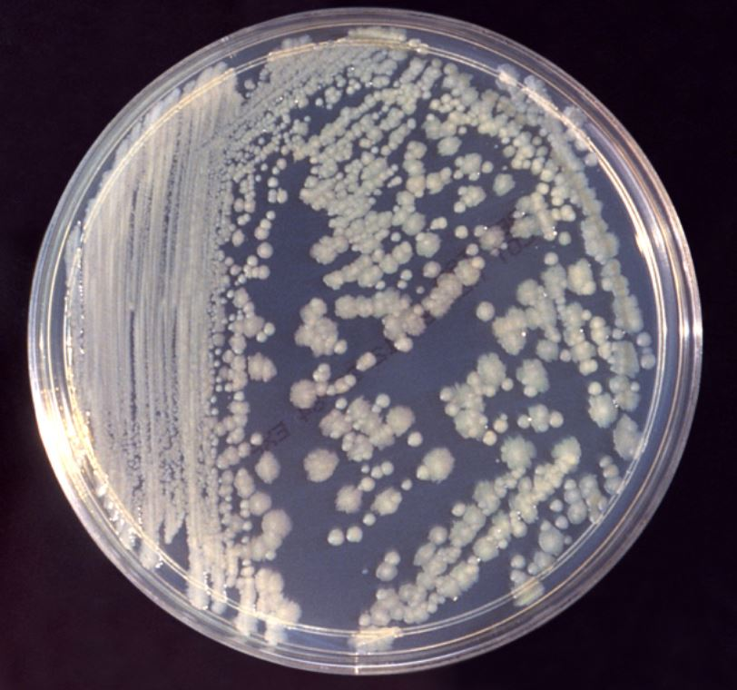

Cancer: The Emperor of all Maladies. For decades, scientists from all
disciplines have dedicated their careers in hopes of defeating this
insidious disease. Unfortunately, these efforts have not yielded
effective long-term solutions for battling cancer and its vengeful
relapses.

This paper titled 'Bacterial survival strategies suggest rethinking
cancer cooperativity' suggests a fresh outlook on cancer by drawing
multiple parallels between tumours and bacterial colonies. According to
the writers, a more communal-oriented research approach is necessary if
one wants to truly understand the dynamics of cancer. What better way to
do this other than comparing it with one of nature's most thriving
communities?

Bacteria form highly complex societies comprising of multiple sub-clonal
populations each dedicated to serving specific purposes for the benefit
of the colony as a whole. For example, 'persister cells' serve as latent
juggernauts whenever the colony is subjected to harsh conditions. They
survive through lethal antibiotic doses and enable the revival of the
bacterial colony once the conditions become optimal. 'Competent cells'
sample the available plethora of genetic variability and select traits
that are best suited for survivability. Once the mother colony is
established, search parties are sent out to explore other regions of the
local environment to find more colonization opportunities. These search
parties and colonies remain in constant communication with the mother
colony through chemical signals or by utilising the information brought
back by the migrating bacteria.

An exciting example of this is the way in which the population as a
whole deals with stress factors such as antibiotics. If an antibiotic is
detected in one of the secondary colonies, a message is sent to the
mother colony which results in a troop of antibiotic resistant bacteria
being sent to the secondary colony in order to ensure its survival.

  
  <figcaption>Enterobacter Cloacae</figcaption>

Cancer shows multiple similarities with bacteria in terms of its social
interactions. Since it is capable of extreme proliferation, it too has
multiple subpopulations with phenotypic variability. The primary tumour
sends CTCs (Circulating Tumour Cells) in search of new locations for
colonization. The process of cancer spreading from the primary tumour is
termed as metastasis which is responsible for 90% of cancer deaths.
These CTCs then form colonies and remain in constant communication with
the primary tumour. They send cells back to the colony which then
reintegrate with the mother colony in a process termed 'self-seeding'
which has been shown to increase cancer growth. These self-seeding cells
bring back valuable information that the primary tumour utilizes to
prepare future CTCs with proper traits to ensure their survival in the
paths that they encounter.

The way cancer becomes dormant and relapses is very similar to bacterial
sporulation. When bacteria are subjected to extreme conditions like
antibiotics, they form spores and become dormant until conditions become
favourable again. Surprisingly, the germinated form of these bacteria is
now resistant to the antibiotic stress. Similarly, cancer relapses
result in treatment-resistant tumours. Although the individual decision
of cells to become dormant might be stochastic, it is controlled on a
population basis.

Another impressive feature of cancer is its ability to enslave
surrounding cells and use them to its advantage. It is even capable of
tricking the immune system and in certain cases, uses the immune system
to promote its growth!

The most exciting part of this paper was the writers' explanation for
the resemblances cancer has with bacteria. How is it possible for
eukaryotes to display such striking similarities with prokaryotes? To
answer this, we must first understand that cancer is the result of
breakdown of multiple regulatory systems that characterize a eukaryotic
cell. Thus, in effect, the cells lose their eukaryotic nature and fall
back to their ancient prokaryotic heritage. It is almost an atavistic
return of primal survival strategies.

As is illustrated above, tumours are not simple cohorts of uncontrolled
cells without a leash. Instead, they are highly structured societies
with complex architecture that behave almost like individual organisms,
much like bacteria. Therefore the best way to defeat cancer would be to
disrupt its organizational stability, resulting in a communication
breakdown which would render its social intelligence useless. For
example, removal of primary tumour followed by subsequent suppression of
dormant metastases (secondary tumours) could be effective in preventing
relapses. We need to study cancer as a whole, not as individual cells.

I implore you to read the original paper to truly understand cancer and
its lethal intricacies.

Reference- "Bacterial survival strategies suggests rethinking cancer
cooperativity"
